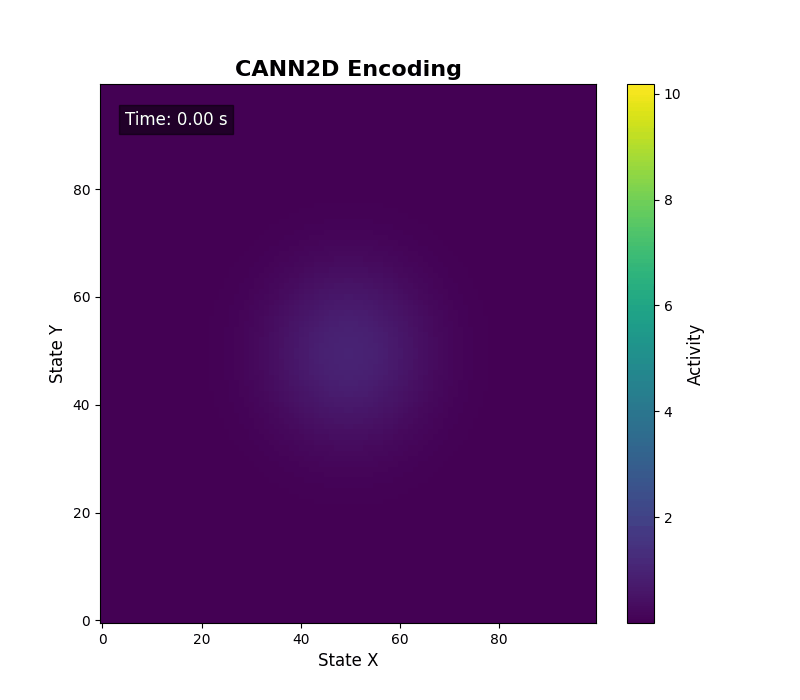
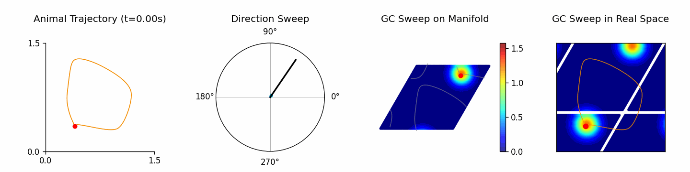

# CANNs: Continuous Attractor Neural Networks Toolkit

<div align="center">
  
</div>

[](https://github.com/routhleck/canns)

[](https://github.com/routhleck/canns)
<picture></picture>
<picture></picture>
[](https://doi.org/10.5281/zenodo.18453893)


<picture></picture>
[](https://pepy.tech/projects/canns)
[](https://deepwiki.com/Routhleck/canns)
[](https://buymeacoffee.com/forrestcai6)

> 中文说明请见 [README_zh.md](README_zh.md)

## Overview

CANNs (Continuous Attractor Neural Networks toolkit) is a research toolkit built on [BrainPy](https://github.com/brainpy/BrainPy) and [JAX](https://github.com/jax-ml/jax), with optional Rust-accelerated [`canns-lib`](https://github.com/Routhleck/canns-lib) for selected performance-critical routines (e.g., TDA/Ripser and task generation). It bundles model collections, task generators, analyzers, and the ASA pipeline (GUI/TUI) so researchers can run simulations and analyze results in a consistent workflow. The API separates models, tasks, analyzers, and trainers to keep experiments modular and extensible.

## Architecture

<p align="center">
  
  <br>
  <span style="color: grey; font-size: 14px;">Layer hierarchy of the CANNs library showing five levels: Application (Pipeline orchestration), Functional (Task, Trainer, Analyzer, Utils modules), Core Models (CANN implementations), Foundation (BrainPy/JAX and Rust FFI backends), and Hardware (CPU/GPU/TPU support)</span>
</p>

The CANNs library follows a modular architecture guided by two core principles: **separation of concerns** and **extensibility through
base classes**. The design separates functional responsibilities into five independent modules: 
1. **Models** (`canns.models`) define neural network dynamics; 
2. **Tasks** (`canns.task`) generate experimental paradigms and input data; 
3. **Analyzers** (`canns.analyzer`) provide visualization and analysis tools;
4. **Trainers** (`canns.trainer`) implement learning rules for brain-inspired models; 
5. **Pipeline** (`canns.pipeline`) orchestrates complete workflows.

Each module focuses on a single responsibility—models don't generate input data, tasks don't analyze results, and analyzers don't modify
parameters. This separation ensures maintainability, testability, and extensibility. All major components inherit from abstract base classes
(`BasicModel`, `BrainInspiredModel`, `Trainer`) that define standard interfaces, enabling users to create custom implementations that
seamlessly integrate with the built-in ecosystem.

## Core Features


- **Model collections**: basic CANNs (1D/2D, SFA), hierarchical path integration, theta-sweep models, brain-inspired models (e.g., Amari-Hopfield, linear/spiking layers)
- **Task generators**: smooth tracking, population coding, template matching, open/closed-loop navigation
- **Analyzer suite**: energy landscapes, tuning curves, raster/firing-rate plots, TDA and decoding utilities, cell classification
- **ASA pipeline & GUI/TUI**: end-to-end workflow for preprocessing, TDA, decoding, and result visualization (e.g., CohoMap/CohoSpace/PathCompare/FR/FRM/GridScore)
- **Training & extensibility**: HebbianTrainer plus base classes for consistent extension
- **Optional acceleration**: `canns-lib` for selected performance-critical routines

## Analyzer Visuals

<p align="center">
  
  <br>
  <span style="color: grey; font-size: 14px;">Overview of Neural Dynamics Models. Comparison of three basic models: (A) 1D CANN, (B) 2D CANN, and (C) Grid Cell Network</span>
</p>

<p align="center">
  
  <br>
  <span style="color: grey; font-size: 14px;">Rich Analyzer Visualization Results</span>
</p>
<p align="center">
  
  <br>
  <span style="color: grey; font-size: 14px;">ASA GUI preview</span>
</p>
<p align="center">
  <a href="https://youtu.be/OoEo5Qa9f7M">
    
  </a>
  <br>
  <span style="color: grey; font-size: 14px;">ASA GUI demo video</span>
</p>

<div align="center">
<table>
<tr>
<td align="center" width="50%" valign="top">
<h4>Smooth Tracking 1D</h4>

<br><em>Activity bump following a moving stimulus</em>
</td>
<td align="center" width="50%" valign="top">
<h4>CANN2D Encoding</h4>

<br><em>2D population encoding patterns over time</em>
</td>
</tr>
<tr>
<td colspan="2" align="center">
<h4>Theta Sweep Animation</h4>

<br><em>Theta-modulated sweep dynamics</em>
</td>
</tr>
<tr>
<td align="center" width="50%" valign="top">
<h4>Bump Analysis</h4>

<br><em>Bump fitting and stability diagnostics</em>
</td>
<td align="center" width="50%" valign="top">
<h4>Torus Bump</h4>

<br><em>Bump dynamics projected onto a torus manifold</em>
</td>
</tr>
</table>
</div>

## Quick Start

1D CANN smooth tracking (imports → simulation → visualization)

```python
import brainpy.math as bm
from canns.analyzer.visualization import PlotConfigs, energy_landscape_1d_animation
from canns.models.basic import CANN1D
from canns.task.tracking import SmoothTracking1D

# simulation time step
bm.set_dt(0.1)

# build model
cann = CANN1D(num=512)

# build tracking task (Iext length = duration length + 1)
task = SmoothTracking1D(
    cann_instance=cann,
    Iext=(0.0, 0.5, 1.0, 1.5),
    duration=(5.0, 5.0, 5.0),
    time_step=bm.get_dt(),
)
task.get_data()


# one-step simulation callback
def step(t, stimulus):
    cann(stimulus)
    return cann.u.value, cann.inp.value


# run simulation loop
us, inputs = bm.for_loop(
    step,
    operands=(task.run_steps, task.data),
)

# visualize with energy landscape animation
config = PlotConfigs.energy_landscape_1d_animation(
    time_steps_per_second=int(1 / bm.get_dt()),
    fps=20,
    title="Smooth Tracking 1D",
    xlabel="State",
    ylabel="Activity",
    show=True,
)

energy_landscape_1d_animation(
    data_sets={"u": (cann.x, us), "Iext": (cann.x, inputs)},
    config=config,
)
```

## Installation

```bash
# CPU-only
pip install canns

# Optional accelerators (Linux)
pip install canns[cuda12]
pip install canns[cuda13]
pip install canns[tpu]

# GUI (ASA Pipeline)
pip install canns[gui]
```

Optional (uv):

```bash
uv pip install canns
```

## Docs & Examples

- Documentation and tutorials: <https://routhleck.com/canns/>
- Local scripts: `examples/`
- Sphinx docs and notebooks: `docs/`
- ASA GUI entry: `canns-gui`

## Citation

If you use CANNs in your research, please cite:

```bibtex
@software{he_2026_canns,
  author       = {He, Sichao and
                  Tuerhong, Aiersi and
                  She, Shangjun and
                  Chu, Tianhao and
                  Wu, Yuling and
                  Zuo, Junfeng and
                  Wu, Si},
  title        = {CANNs: Continuous Attractor Neural Networks Toolkit},
  month        = feb,
  year         = 2026,
  publisher    = {Zenodo},
  version      = {v1.0.0},
  doi          = {10.5281/zenodo.18453893},
  url          = {https://doi.org/10.5281/zenodo.18453893}
}
```

**Plain text:**
> He, S., Tuerhong, A., She, S., Chu, T., Wu, Y., Zuo, J., & Wu, S. (2026). CANNs: Continuous Attractor Neural Networks Toolkit (v1.0.0). Zenodo. https://doi.org/10.5281/zenodo.18453893

## Contributing & License

Contributions are welcome. Please read [CONTRIBUTING.md](CONTRIBUTING.md) before opening a PR.

Apache License 2.0. See [LICENSE](LICENSE).
