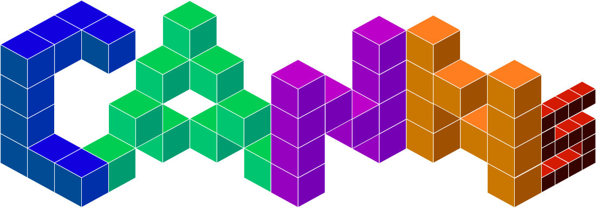
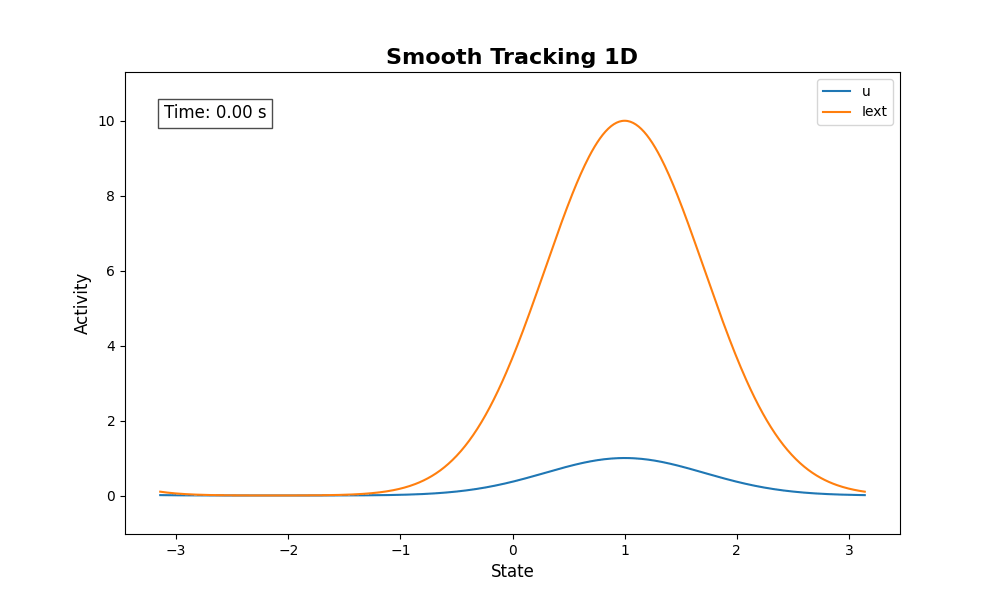
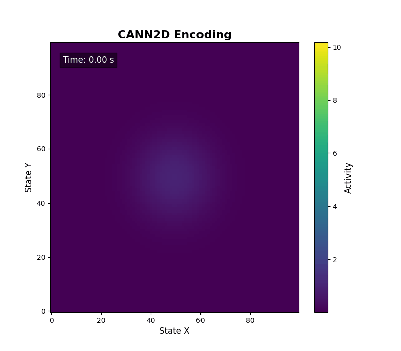
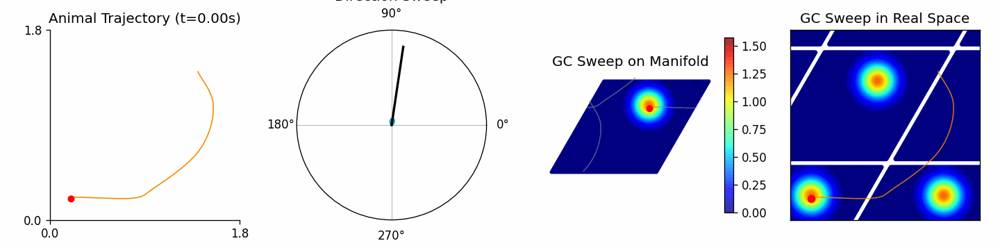
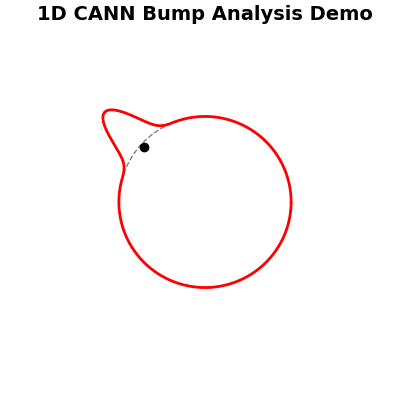
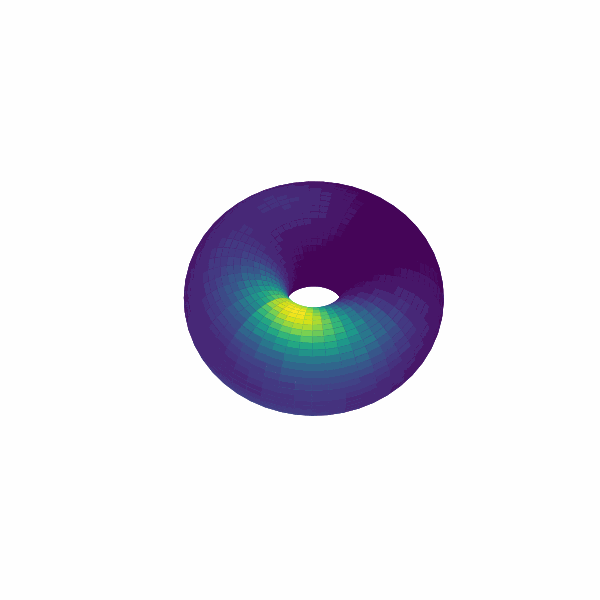

# CANNs：连续吸引子神经网络工具包

<div align="center">
  
</div>

[](https://github.com/routhleck/canns)

[](https://github.com/routhleck/canns)
<picture></picture>
<picture></picture>
[](https://doi.org/10.5281/zenodo.17412545)


<picture></picture>
[](https://pepy.tech/projects/canns)
[](https://deepwiki.com/Routhleck/canns)
[](https://buymeacoffee.com/forrestcai6)

> English version: [README.md](README.md)

## 概览

CANNs（Continuous Attractor Neural Networks toolkit）是基于 [BrainPy](https://github.com/brainpy/BrainPy) 和 [JAX](https://github.com/jax-ml/jax) 构建的研究工具库，并可选使用 Rust 加速库 [`canns-lib`](https://github.com/Routhleck/canns-lib) 优化部分性能敏感例程（如 TDA/Ripser 与任务生成）。它提供模型集合、任务生成器、分析器以及 ASA 流水线（GUI/TUI），帮助研究者在统一工作流中完成仿真与分析。API 按模型、任务、分析器和训练器分层设计，便于模块化扩展。

## 架构

<p align="center">
  
  <br>
  <span style="color: grey; font-size: 14px;">架构概览：模型、任务、分析器、训练器与流水线基于 BrainPy/JAX，部分环节可选 Rust 加速。</span>
</p>

CANNs 采用模块化架构，遵循两条核心原则：**关注点分离** 与 **通过基类实现可扩展性**。
设计将功能职责拆分为五个独立模块：
1. **模型**（`canns.models`）定义神经网络动力学；
2. **任务**（`canns.task`）生成实验范式与输入数据；
3. **分析器**（`canns.analyzer`）提供可视化与分析工具；
4. **训练器**（`canns.trainer`）实现类脑模型的学习规则；
5. **流水线**（`canns.pipeline`）端到端完整工作流。

各模块职责单一——模型不生成输入、任务不分析结果、分析器不修改参数。
这种设计有利于维护、测试与扩展。核心组件继承抽象基类
（`BasicModel`、`BrainInspiredModel`、`Trainer`），
保证自定义实现能与内置生态无缝集成。

## 核心特性

- **模型集合**：基础 CANN（1D/2D、SFA）、层级路径积分、theta-sweep 模型、类脑模型（如 Amari-Hopfield、线性/脉冲层）
- **任务生成**：平滑追踪、群体编码、模板匹配、开/闭环导航
- **分析器能力**：能量景观、调谐曲线、栅格/放电率图、TDA 与解码工具、细胞分类
- **ASA 流水线 & GUI/TUI**：端到端流程（预处理、TDA、解码与结果可视化，如 CohoMap/CohoSpace/PathCompare/FR/FRM/GridScore）
- **训练与扩展**：HebbianTrainer 与统一基类便于扩展
- **可选加速**：`canns-lib` 覆盖部分性能敏感例程

## Analyzer 可视化

<p align="center">
  
  <br>
  <span style="color: grey; font-size: 14px;">神经动力学模型对比概览。 该图比较了三种经典基础模型：(A) 一维连续吸引子网络 (CANN 1D)，(B) 二维连续吸引子网络 (CANN 2D)，以及 (C) 网格细胞网络 (Grid Cell)</span>
</p>

<p align="center">
  
  <br>
  <span style="color: grey; font-size: 14px;">丰富的 Analyzer 可视化结果</span>
</p>
<p align="center">
  
  <br>
  <span style="color: grey; font-size: 14px;">ASA GUI 预览</span>
</p>
<p align="center">
  <a href="https://youtu.be/OoEo5Qa9f7M">
    
  </a>
  <br>
  <span style="color: grey; font-size: 14px;">ASA GUI 演示视频</span>
</p>

<div align="center">
<table>
<tr>
<td align="center" width="50%" valign="top">
<h4>Smooth Tracking 1D</h4>

<br><em>活动波包随刺激移动</em>
</td>
<td align="center" width="50%" valign="top">
<h4>CANN2D Encoding</h4>

<br><em>二维群体编码的演化过程</em>
</td>
</tr>
<tr>
<td colspan="2" align="center">
<h4>Theta Sweep Animation</h4>

<br><em>Theta 调制下的扫描动力学</em>
</td>
</tr>
<tr>
<td align="center" width="50%" valign="top">
<h4>Bump Analysis</h4>

<br><em>波包拟合与稳定性分析</em>
</td>
<td align="center" width="50%" valign="top">
<h4>Torus Bump</h4>

<br><em>环面流形上的波包投影</em>
</td>
</tr>
</table>
</div>

## 快速开始

1D CANN 平滑追踪（导入 → 仿真 → 可视化）

```python
import brainpy.math as bm
from canns.analyzer.visualization import PlotConfigs, energy_landscape_1d_animation
from canns.models.basic import CANN1D
from canns.task.tracking import SmoothTracking1D

# 模拟时间步长
bm.set_dt(0.1)

# 构建模型
cann = CANN1D(num=512)

# 构建追踪任务（Iext 长度 = duration 长度 + 1）
task = SmoothTracking1D(
    cann_instance=cann,
    Iext=(0.0, 0.5, 1.0, 1.5),
    duration=(5.0, 5.0, 5.0),
    time_step=bm.get_dt(),
)
task.get_data()


# 单步仿真回调
def step(t, stimulus):
    cann(stimulus)
    return cann.u.value, cann.inp.value


# 运行仿真循环
us, inputs = bm.for_loop(
    step,
    operands=(task.run_steps, task.data),
)

# 能量景观动画可视化
config = PlotConfigs.energy_landscape_1d_animation(
    time_steps_per_second=int(1 / bm.get_dt()),
    fps=20,
    title="Smooth Tracking 1D",
    xlabel="State",
    ylabel="Activity",
    show=True,
)

energy_landscape_1d_animation(
    data_sets={"u": (cann.x, us), "Iext": (cann.x, inputs)},
    config=config,
)
```

## 安装

```bash
# 仅 CPU
pip install canns

# 可选加速（Linux）
pip install "canns[cuda12]"
pip install "canns[cuda13]"
pip install "canns[tpu]"

# GUI（ASA Pipeline）
pip install "canns[gui]"
```

可选（uv）：

```bash
uv pip install canns
```

## 文档&示例

- 文档与教程：<https://routhleck.com/canns/>
- 快速入门与设计笔记：<https://routhleck.com/canns/en/notebooks/>
- 本地示例脚本：`examples/`
- Sphinx 文档与 Notebook：`docs/`
- ASA GUI 入口：`canns-gui`

## 贡献&许可证

欢迎提交 Issue / PR。请先阅读 [CONTRIBUTING.md](CONTRIBUTING.md)。

Apache License 2.0。详见 [LICENSE](LICENSE)。
