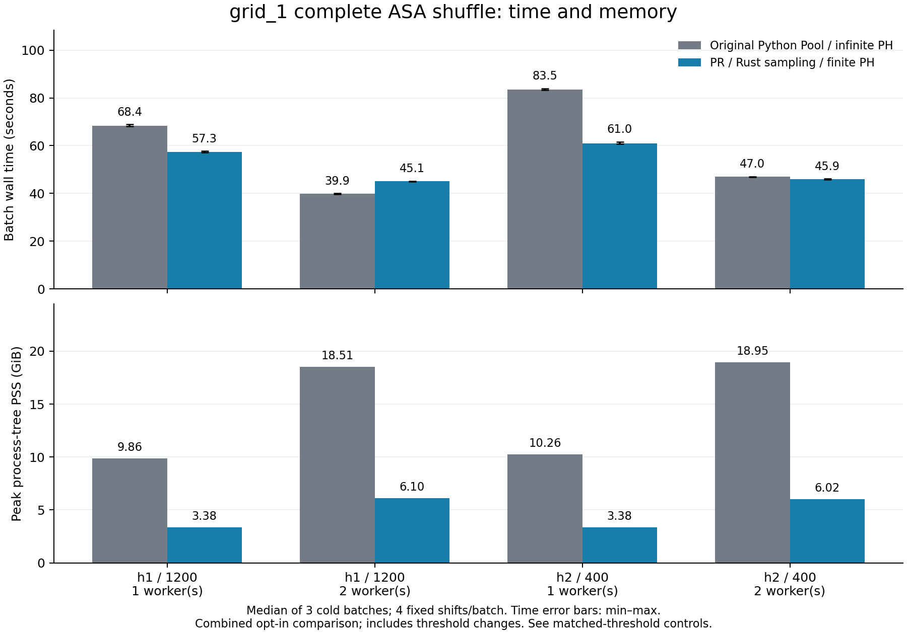

# Measured results — 2026-09-22

The current coordinated PR pipeline reduces sampled peak process-tree PSS
by **65.8–68.3%** in these tests. Single-worker cold batches are faster, but
**two-worker H1 is slower**: 45.14 s versus 39.88 s (about 13% more time).
Two-worker H2 is close: 45.93 s versus 47.04 s. These results do not establish
that the new pipeline is faster for every workload or concurrency setting.

The comparison uses the original Python Pool ASA path and the current PR
with explicit Rust sampling and finite PH. Both sides already use Rust PH.
Each batch has **4 fixed shifts**, repeated 3 times; 36 jobs execute 144 rounds
but do not supply 144 independent null draws. All jobs succeeded.
H1 uses 1,200 selected points, H2 uses **400**, both from the full grid_1 input.
See [protocol and source revisions](../README.md), [all measurements](measurements.csv),
[machine-readable summary](summary.json) and [environment/provenance](environment.json).

## Separate threshold and pipeline effects

At the same finite threshold, the new single-worker pipeline is **1.189×**
faster in both cases (median of paired ratios). At the same infinite threshold,
the ratios are **1.176× for H1** and **1.200× for H2**. These gains combine the
sampling kernels, PH implementation, scheduling and allocation changes.
They are not an isolated measurement of one Rust function.

Within the new pipeline, changing only the PH threshold gives **1.022× H1**
and **1.143× H2** full-batch speedups. These are complete-batch measurements;
they must not be presented as pure PH kernel speedups. The same-threshold
controls were run with one worker only, after the main suite, so host drift
between suites is a limitation. Repetitions alternate variant order within
each suite. Three repeats on one VM support local engineering comparisons,
not broad confidence intervals or a general speed guarantee.

## Next optimization targets

1. Profile density sampling and its temporary dense matrices first: recorded
   stage durations dominate these batches. Preserve selected indices and graph
   values when evaluating alternatives.
2. Investigate the two-worker H1 regression with a separate warmed benchmark
   and thread-contention profile. `fuzzy_union` currently retains the GIL while
   borrowing NumPy inputs, and several surrounding Numba kernels do not enable
   `nogil`. These are candidates to measure, not an established sole cause.
   Any GIL release must use safe ownership and retain exact numerical tests.
3. Evaluate copy/allocation reductions and process versus thread scheduling
   under matched memory and worker budgets. Larger batches are needed to
   distinguish cold JIT/startup cost from steady-state throughput.

No numerical source was changed during this benchmark. Sampling and finite
threshold choices remain explicit opt-ins. This benchmark checks implementation
equality for its recorded input/shifts; it does not validate every parameter
combination or claim exact reproduction of every choice in the paper.

## Full measurements and acceptance

All durations below are cold shuffle-batch wall times, including Numba JIT, pool creation,
IPC, shifts, complete preprocessing and PH. Imports and input loading are excluded.
Repetitions use the same recorded shifts; they are performance repetitions, not independent null draws.

| Case | Workers | Variant | Median s [min, max] | Tree PSS GiB | Tree RSS GiB |
|---|---:|---|---:|---:|---:|
| grid1_h1_1200 | 1 | legacy-default | 68.384 [68.101, 68.855] | 9.859 | 10.158 |
| grid1_h1_1200 | 1 | legacy-finite | 68.108 [67.976, 68.571] | 9.840 | 10.154 |
| grid1_h1_1200 | 1 | pr-finite | 57.289 [57.058, 57.682] | 3.376 | 3.386 |
| grid1_h1_1200 | 1 | pr-legacy | 58.398 [58.171, 58.527] | 3.384 | 3.395 |
| grid1_h1_1200 | 2 | legacy-default | 39.883 [39.724, 40.030] | 18.508 | 19.135 |
| grid1_h1_1200 | 2 | pr-finite | 45.141 [44.858, 45.231] | 6.100 | 6.110 |
| grid1_h2_400 | 1 | legacy-default | 83.514 [83.203, 83.963] | 10.259 | 10.620 |
| grid1_h2_400 | 1 | legacy-finite | 72.468 [72.276, 72.626] | 10.063 | 10.369 |
| grid1_h2_400 | 1 | pr-finite | 60.965 [60.673, 61.609] | 3.378 | 3.388 |
| grid1_h2_400 | 1 | pr-legacy | 69.808 [69.326, 69.905] | 3.377 | 3.388 |
| grid1_h2_400 | 2 | legacy-default | 47.038 [46.774, 47.123] | 18.950 | 19.810 |
| grid1_h2_400 | 2 | pr-finite | 45.933 [45.818, 46.175] | 6.018 | 6.028 |

| Case | Workers | Comparison | Paired median speedup [min, max] | Median PSS reduction |
|---|---:|---|---:|---:|
| grid1_h1_1200 | 1 | legacy-default → pr-finite | 1.189× [1.186, 1.207] | 65.8% |
| grid1_h1_1200 | 1 | legacy-default → pr-legacy | 1.176× [1.164, 1.179] | 65.7% |
| grid1_h1_1200 | 1 | legacy-finite → pr-finite | 1.189× [1.187, 1.194] | 65.7% |
| grid1_h1_1200 | 1 | pr-legacy → pr-finite | 1.022× [1.008, 1.023] | 0.2% |
| grid1_h1_1200 | 2 | legacy-default → pr-finite | 0.887× [0.878, 0.889] | 67.0% |
| grid1_h2_400 | 1 | legacy-default → pr-finite | 1.371× [1.356, 1.377] | 67.1% |
| grid1_h2_400 | 1 | legacy-default → pr-legacy | 1.200× [1.196, 1.201] | 67.1% |
| grid1_h2_400 | 1 | legacy-finite → pr-finite | 1.189× [1.179, 1.191] | 66.4% |
| grid1_h2_400 | 1 | pr-legacy → pr-finite | 1.143× [1.133, 1.147] | -0.0% |
| grid1_h2_400 | 2 | legacy-default → pr-finite | 1.026× [1.013, 1.027] | 68.3% |

Acceptance: 36 jobs; 144 completed round executions; 86275 full-array comparisons between distinct jobs passed (reference self-checks excluded).
All H0/H1/H2 arrays applicable to each case, including short and essential bars and all returned cocycles, were reopened and compared exactly.
Offsets, PCA output, selected indices and final distance-graph hashes also match.

The combined comparison includes the opt-in finite PH threshold. It is not a Rust-only speedup.
PSS is sampled every 0.2 s, RSS every approximately 0.02 s across the process tree; peaks are sampled lower bounds.
Summed RSS counts shared fork pages more than once. PSS apportions shared pages and is the primary memory comparison.
Stage times are sums across rounds and can exceed wall time when workers overlap. See measurements.csv.
These are one-host measurements; repetition and fixed-shift counts are recorded in the plans. No universal speedup or significance claim is made.
