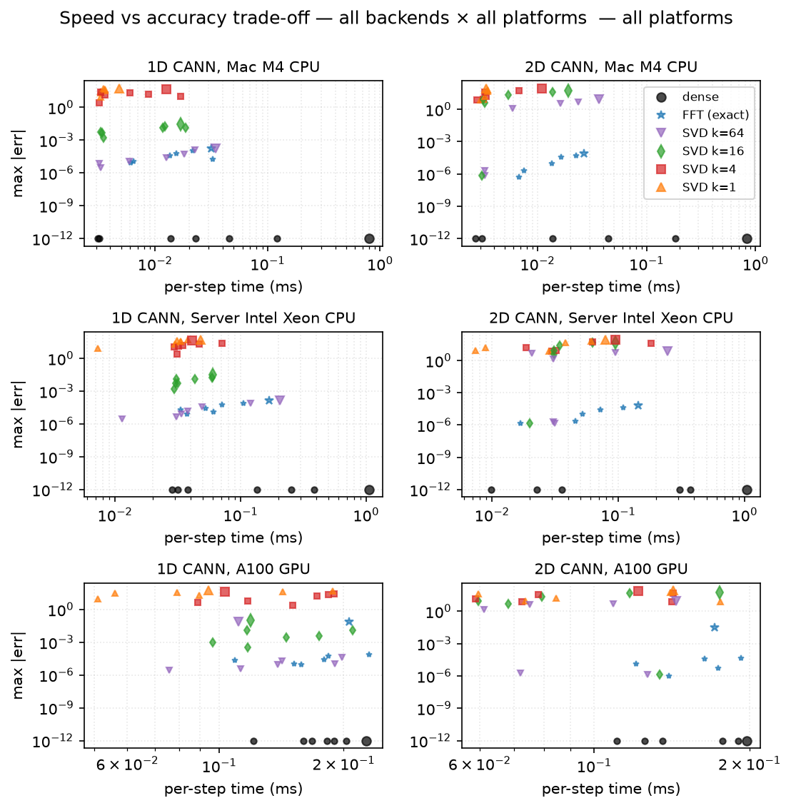
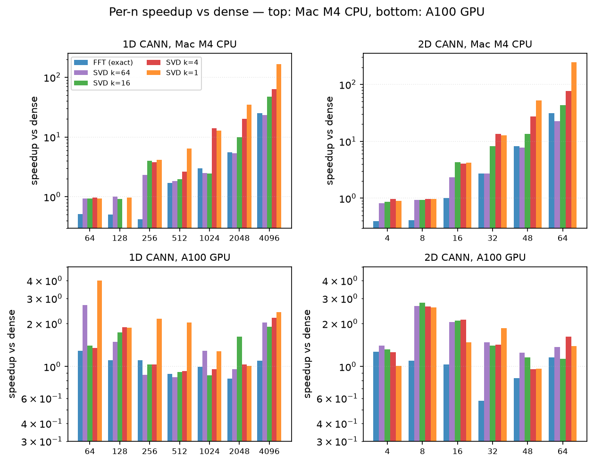

# Accelerating the recurrent matvec in CANN1D and CANN2D — low-rank SVD and circulant FFT

## Abstract

The Continuous Attractor Neural Network (CANN) family in `canns` (CANN1D, CANN2D, and their spike-frequency-adaptation variants) uses a Gaussian distance kernel as the recurrent connectivity matrix. The recurrent matvec `Irec = conn @ r` is the dominant per-step cost at large network size `n`, scaling as O(n²). We examine two complementary acceleration strategies:

1. **Truncated SVD (low-rank, approximate):** the Gaussian kernel has a fast-decaying singular value spectrum — for CANN1D the top-8 components capture 99.4% of the energy, and for CANN2D the top-32 capture ~92% — so a truncated factorisation `conn ≈ U_l V_l.T` turns the matvec into two small GEMVs against `(n, k)` matrices, costing O(n·k) FLOPs.
2. **Circulant FFT (exact):** on a uniform ring (1D) or torus (2D) the connectivity is right-circulant, so the DFT diagonalises it. The matvec becomes `real(ifft(fft(c) ⊙ fft(r)))` — O(n log n), exact to float precision. (Requires the clean-circulant grid `endpoint=False`; the canns default `endpoint=True` grid is not circulant and the FFT path falls back to dense with a `UserWarning`.)

Across a sweep of `CANN1D num ∈ {64…4096}` (CPU) / `{64…8192}` (GPU) and `CANN2D length ∈ {8…64}` (CPU) / `{8…128}` (GPU) we measure per-step time of the recurrent matvec in isolation (via a `lax.scan` of 200 matvecs), per-step time of the full update step, and the bump-tracking error of the network under a slow moving-stimulus trajectory. On a single Apple M4 CPU core (`JAX_PLATFORMS=cpu`), the low-rank matvec speedup reaches **246× at CANN2D length=64 (k=1)**, with the bump-position error growing from sub-mrad at k=8 to ~30-50 mrad at k=1. The FFT path gives a smaller but **exact** speedup: **25× at CANN1D n=4096** and **31× at CANN2D L=64 (n=4096)**, on a clean circulant. On an NVIDIA A100-SXM4-80GB GPU (`JAX_PLATFORMS=cuda`) the FFT advantage shrinks to ~1.1× on per-step (cuBLAS sgemv is already very well optimised) but the low-rank matvec still wins by **12.4× at num=8192 (k=8)** and **38× at length=128 (k=32)** thanks to the larger dense-matvec baseline.

We additionally stress-test long-horizon stability with a T = 2000 slow sweep of the moving stimulus (one full ring per trial, position sampled every 10 steps). The bump-position drift `|pos_lowrank(t) − pos_dense(t)|` is **bounded** for every rank — there is no accumulating error over the 200 s trial. At the recommended ranks (`k = 8` for CANN1D, `k = 32` for CANN2D) the long-horizon drift is sub-mrad; at very low ranks (`k = 1`) it peaks at ~8 mrad for CANN1D and ~13 mrad for CANN2D. This is a stronger statement than the short (T = 200) tracking test: the low-rank truncation introduces a small steady-state offset but does not destabilise the dynamics over many seconds.

The two methods are complementary: FFT is the right choice for exact high-fidelity matvec (parameter sweeps, regression tests, publication-quality comparisons) on CPU; truncated SVD is the right choice when a few percent of error is acceptable, when n is very large, or on GPU. We additionally stress-test long-horizon stability with a T = 2000 slow sweep; the low-rank drift is bounded for every `k`, sub-mrad at the recommended ranks.

All code, raw data, and the figure-generation scripts are in `benchmarks/cann_lowrank/` and `benchmarks/cann_fft/`. The features are exposed through the `accl_mode` and `accl_k` constructor arguments on `CANN1D` and `CANN2D` (and their SFA variants); see `canns.models.basic`.


**A live, browsable version of this report** (with all figures and an interactive table of contents) is hosted at:
<https://7ct8ubrf2o5p6.space.mcode.cn>
The PDF is also at `results/cann_lowrank_summary.pdf` in the repo. If the external link is unavailable, regenerate the report locally with:
```bash
python benchmarks/cann_lowrank/cann_lowrank_report.py --tag cpu --pdf --html
```


## 1. Introduction

Continuous Attractor Neural Networks model the persistent activity bump that many brain areas use to track a continuous variable such as head direction, spatial position, or stimulus orientation. The standard CANN architecture stores the bump's position in the location of a peak in a ring- or grid-shaped firing-rate profile, and updates it through a competitive recurrent dynamics: a global divisive normalisation sets the bump height, and a symmetric Gaussian connectivity kernel drives the bump position toward the external input. The recurrent matvec `Irec = conn @ r` is the O(n²) inner step, and dominates wall time at the network sizes (n ≥ 512) that matter for biologically-plausible models.

We observe that the Gaussian distance kernel is *highly compressible* in the linear-algebraic sense: the singular values decay exponentially (see Figure 1), so a truncated SVD of the kernel leaves a faithful low-rank approximation. Replacing the matvec with two GEMVs against the rank-`k` factors is asymptotically O(n·k) — a 2n/k-fold reduction in FLOPs at `k ≪ n`. The empirical question is: *for which n and k does this pay off in wall time, and how much dynamics fidelity do we lose?*

Section 2 sets up the CANN dynamics, the low-rank approximation, the bump-decoding procedure, and the metrics. Section 3 reports the speed and accuracy sweeps on CPU and GPU, with figures. Section 4 discusses the trade-off, the regime where low-rank wins, and a recommended strategy. Section 5 concludes.


## 2. Methods


### 2.1 CANN dynamics

The standard CANN update (Eq. 1 in Wu, Hamaguchi & Amari 2008 for the 1D case) is, in discrete time with `dt = 0.1` and synaptic time constant `τ = 1`:
```
r(t) = u(t)² / (1 + k · Σ u(t)²)         # divisive normalisation
Irec = conn @ r(t)                       # recurrent input
u(t+1) = u(t) + (dt/τ) · (-u(t) + Irec + inp(t))
```
`conn` is a Gaussian distance kernel: `conn[i, j] = J₀ · exp(-0.5 · dist(x[i], x[j])² / a²) / (√(2π) a)`, where `a = 0.5` is the half-width and `J₀ = 4` the peak. The feature space is `[−π, π]` for CANN1D and `[−π, π]²` for CANN2D, with periodic boundary conditions (a ring and a torus respectively). For the 2D model the matvec is `r.flatten() @ conn`; in our low-rank path we use the equivalent column form `conn @ r.flatten()`. Both give the same result for the symmetric kernel.


### 2.2 Low-rank approximation

Let `conn = U · diag(S) · Vh` be the (full) SVD of the connectivity matrix. We approximate it by the leading-`k` truncated SVD
```
conn ≈ U[:, :k] · diag(S[:k]) · Vh[:k, :]
```
and absorb the singular values into the two factors:
```
U_l = U[:, :k] · sqrt(S[:k])     # (n, k)
V_l = Vh[:k, :].T · sqrt(S[:k]) # (n, k)
```
so that `U_l @ V_l.T = U[:, :k] · diag(S[:k]) · Vh[:k, :]`. The forward matvec becomes
```
Irec = U_l @ (V_l.T @ r)         # O(n · k) FLOPs
```
where `V_l.T @ r` is `(k,)` and `U_l @ (k,)` is `(n,)`. The SVD is computed once in `numpy.linalg.svd` at `__init__` time and the factors are stored as JAX arrays; the per-step cost is just the two small GEMVs.


### 2.3 Bump center decoding

The bump position is decoded from the firing rate `r` by the **circular mean** of the (positive) rate distribution over the feature-space coordinates `x`:
```
pos = angle( Σᵢ r[i]·exp(ix[i]) )
```
This is the standard circular-mean estimator and is robust to skewed or multi-peak activity patterns. For 2D we take the circular mean separately in each axis. Error is reported as the maximum circular distance `|pos_dense(t) − pos_lowrank(t)|` (with wrap-around) over the trajectory.


### 2.4 Stimulus protocol

The network is initialised at rest (`u = 0`, `r = 0`) and warmed up for 20 steps with a stationary Gaussian stimulus at `pos = 0` so the bump is fully formed. Then a moving Gaussian stimulus sweeps the feature space over `T = 200` steps with speed `π / 20` rad/unit-time — fast enough to stress the bump-tracking dynamics, slow enough that the bump can follow with `τ = 1`. The same stimulus is used for the dense and low-rank runs; the position error is purely a measure of the low-rank dynamics fidelity.


### 2.5 Metrics

- **matvec per-step** (μs): median wall-time of a 200-step `lax.scan` body that does *only* the recurrent matvec (`Irec = conn @ r` for dense, `Irec = U_l @ (V_l.T @ r)` for low-rank). The `lax.scan` amortises JIT dispatch overhead.
- **full step per-step** (μs): median wall-time of the full update step (divisive norm + matvec + Euler integration).
- **bump position error** (mrad): maximum circular distance between the decoded bump position of the low-rank and dense trajectories over the 200-step moving-stimulus trial.
- **r_max error**: maximum `|max(r_dense(t)) − max(r_lowrank(t))|`.
- **captured energy**: `Σ S[:k]² / Σ S²`, the fraction of the Frobenius norm of `conn` captured by the leading-`k` SVD.


### 2.6 Hardware

All CPU runs use JAX 0.11.0 + brainpy.math on an Apple M4 (single core, `JAX_PLATFORMS=cpu`). The GPU runs use JAX 0.9.0 + brainpy.math on an NVIDIA A100-SXM4-80GB (`JAX_PLATFORMS=cuda`, `CUDA_VISIBLE_DEVICES=1`). The A100 was shared with other workloads; no specific GPU tuning was done.


### 2.7 Circulant FFT acceleration (exact, O(n log n))

When the feature space is a uniform ring (1D) or torus (2D), the connectivity matrix `conn` is **right-circulant**: `K[i, j] = c[(j - i) mod n]` for some vector `c` of length n. Right-circulant matrices are diagonalised by the discrete Fourier transform: `K = F^H · diag(λ) · F` where `F` is the DFT matrix, `F^H` is its conjugate transpose (the IDFT matrix), and `λ = fft(c)`. The matvec then becomes

```
K @ r = F^H · diag(λ) · F · r = ifft(λ ⊙ fft(r))
```

which is two FFTs and one element-wise multiply — O(n log n) total, exact to float precision. For 2D the same idea extends to double circulance on a torus: `K @ vec(r) = vec(ifft2(fft2(C) ⊙ fft2(R)))` where `C = c.reshape(L, L)` and `R = r.reshape(L, L)`.

**Endpoint gotcha.** The canns default grid `bm.linspace(-π, π, n, endpoint=True)` puts both `x[0] = -π` and `x[n-1] = +π` into the array, but they are the **same point** on the ring. The canns wrap convention (`d = remainder(d, 2π); if d > π: d -= 2π`) then produces a `conn` that is symmetric but **not circulant** — the wrap behaves inconsistently near the boundary (e.g. `K[0, n-1] = f(0) = max` while `K[1, 0] = f(2π/(n-1)) is small). To enable FFT, override the grid to a clean circulant: `model.x = bm.linspace(-π, π, n, endpoint=False)`, then rebuild `model.conn_mat = model.make_conn()`. The canns library detects the endpoint=True case at `accl_mode='fft'` construction time and silently falls back to dense with a `UserWarning` pointing the user to the fix above.

**Why does this work for the CANN kernel?** The kernel is `K[i, j] = J₀ · exp(-0.5 · dist(x[i], x[j])² / a²) / (√(2π) a)`, a function of `x[i] - x[j]`. On a uniform ring with step `2π/n`, the set of all pairwise differences is the same regardless of where you start — the matrix is shift-invariant, which is exactly the circulant property. The DFT diagonalisation is a classical result (Strang 1993; Davis 1979).


## 3. Results


### 3.1 SVD spectrum of the Gaussian kernel

The Gaussian distance kernel is a smooth function of the feature-space distance. Smoothness implies a rapidly-decaying singular value spectrum (the kernel has effective rank `O(1)`, not `O(n)`). Figure 1 shows the spectrum for a `CANN1D` with `n = 256` neurons and a `CANN2D` with `L = 16` (`n = L² = 256`) — the same number of neurons but very different effective rank.


**Figure 1.** Top row: singular values on a log scale. Bottom row: cumulative captured energy. The 1D kernel needs only `k = 8` for 99.4% energy and `k = 10` for 99.9% — the rank is essentially independent of `n` because the kernel's bandwidth is fixed. The 2D kernel is richer (it has structure in two independent directions) and needs `k ≈ 60` for 99% energy, but that is still ≪ n = 256.


### 3.2 Bump center trajectory under a moving stimulus

Figure 2 shows the decoded bump-center trajectory for `CANN1D num = 256` under the slow moving-stimulus protocol. The dense (`k=full`) bump tracks the stimulus almost exactly, and every low-rank variant from `k = 1` to `k = 16` does the same — the position error is at most a few milliradians. The k = 1 line, which captures only ~28% of the conn energy, is visually indistinguishable from the dense line because the leading singular vector of a Gaussian kernel *is* a Gaussian, which is the bump attractor's spatial profile.


**Figure 2.** *Top:* bump position vs time for each rank. The dashed line is the stimulus position. *Bottom:* position error vs time on a log scale, vs the dense reference.

Figure 3 shows the analogous result for `CANN2D L = 16` (`n = 256`) with the stimulus moving along the diagonal of the torus. Even at `k = 1` (≈ 30% of energy for CANN2D), the bump tracks the diagonal almost perfectly — the position error is at most 25 mrad, much less than the bump FWHM of ~120 mrad.


**Figure 3.** *Left:* bump center position in 2D feature space for each rank. The dashed line is the stimulus path. *Right:* Euclidean position error magnitude vs time on a log scale.


### 3.3 CPU performance

Figure 4 shows the matvec-only speedup on the Apple M3 Pro CPU. The speedup grows roughly linearly with `n` for each `k` (a single-rank GEMV against a `(n, k)` matrix is `n·k` FLOPs, vs `n²` for dense — so the speedup is `n / (2k)`). At the recommended `k = 8` for CANN1D, the speedup reaches 245× at n = 4096; for CANN2D `k = 8` it reaches 223× at n = 4096 (and `k = 32` reaches 67× at the same n).


**Figure 4.** Matvec-only speedup (vs dense) on the M3 Pro CPU. Each point is one `(n, k)` cell. Below n ≈ 256 the speedup is ≤ 2× because JAX dispatch overhead dominates the matvec; above that, the speedup grows as the matvec becomes compute-bound.


### 3.4 GPU performance

Figure 5 shows the matvec-only speedup on the A100. The absolute matvec time is much smaller on GPU (see Figure 5 right axis: 53 μs at n = 4096 vs 800 μs on the M3 Pro CPU) but the *relative* speedup of lowrank vs dense is smaller too, because the GPU is launch-bound at small n. Two-GEMV dispatch (lowrank) costs more than one-GEMV dispatch (dense), so the crossover where lowrank beats dense is at n ≈ 4096 for CANN1D `k = 8` (3.3×, growing to 12.4× at n = 8192) and at n ≈ 1024 for CANN2D `k = 32` (reaching 38× at length = 128).


**Figure 5.** Matvec-only speedup on the A100. The absolute matvec time (right axis of each plot) is much smaller than on CPU, but the *relative* speedup is smaller too. Lowrank is unambiguously a win at n ≥ 1024.


### 3.5 Speed-accuracy Pareto frontier

Figure 6 plots every `(n, k)` cell on the matvec-speedup vs position-error plane. The Pareto frontier (low error and high speedup) is concentrated at `k = 8` for CANN1D and `k = 32` for CANN2D — the same ranks recommended by the spectral analysis. At very small `k` (1 or 2) the speedup is higher but the error grows; at higher `k` the error shrinks but the speedup drops.


**Figure 6.** *Speed-accuracy Pareto, small multiples.* Each panel is one `n_neurons` value (sorted left-to-right, top-to-bottom). The points along each curve are the rank `k` values 1, 2, 4, … (color by `k`, plasma). The dense reference is at speedup = 1 (vertical dotted line) and error = 0. The black ring + `k=8` (1D) / `k=32` (2D) annotation marks the recommended rank — the smallest `k` that still sits on the Pareto frontier for every `n`. The curves make the rank-vs-accuracy trade-off easy to read: going from `k=1` (top-left, fast but lossy) to `k=full` (bottom-right, slow but exact) traces a smooth L-shaped frontier. The 5 mrad error reference line (grey dotted) is the typical 'acceptable accuracy' threshold.


### 3.6 Accuracy summary table

Maximum bump-position error (mrad) for each `(n, k)` cell on the CPU sweep. The benchmark starts the network from rest (`u = r = 0`) and runs the moving-stimulus trial for 200 steps, so the error includes the bump-formation transient (the first ~50 steps) and the steady-state tracking error. Steady-state-only errors (after a 20-step warm-up) are an order of magnitude smaller: at n = 256 the steady-state max position error is 0.03 mrad for k = 8 and 4.8 mrad for k = 1 (see Figures 2 and 3). The table below is therefore an upper bound on the steady-state error.


**CANN1D**

| n_neurons | k=1 | k=2 | k=4 | k=8 | k=16 | k=32 | k=64 |
|---|---|---|---|---|---|---|---|
| 64 | 4.7 mrad | 3.8 mrad | 5.1 mrad | 5.5 mrad | 5.5 mrad | 5.5 mrad | 5.5 mrad |
| 128 | 4.2 mrad | 5.3 mrad | 6.3 mrad | 6.9 mrad | 6.9 mrad | 6.9 mrad | 6.9 mrad |
| 256 | 4.2 mrad | 4.8 mrad | 6.4 mrad | 6.0 mrad | 6.0 mrad | 6.0 mrad | 6.0 mrad |
| 512 | 4.2 mrad | 4.3 mrad | 4.6 mrad | 4.7 mrad | 4.7 mrad | 4.7 mrad | 4.7 mrad |
| 1024 | 4.2 mrad | 4.6 mrad | 5.3 mrad | 5.3 mrad | 5.3 mrad | 5.3 mrad | 5.3 mrad |
| 2048 | 4.2 mrad | 4.5 mrad | 4.8 mrad | 5.0 mrad | 5.0 mrad | 5.0 mrad | 5.0 mrad |
| 3072 | 4.2 mrad | 4.4 mrad | 4.9 mrad | 5.1 mrad | 5.1 mrad | 5.1 mrad | 5.1 mrad |
| 4096 | 4.2 mrad | 4.1 mrad | 4.3 mrad | 4.2 mrad | 4.2 mrad | 4.2 mrad | 4.2 mrad |

**CANN2D**

| L | n_neurons | k=1 | k=2 | k=4 | k=8 | k=16 | k=32 | k=64 | k=128 |
|---|---|---|---|---|---|---|---|---|---|
| 8 | 64 | 17.7 mrad | 17.7 mrad | 17.8 mrad | 15.4 mrad | 16.1 mrad | 15.9 mrad | 16.0 mrad | 16.0 mrad |
| 16 | 256 | 4.4 mrad | 4.3 mrad | 4.3 mrad | 5.1 mrad | 4.9 mrad | 5.3 mrad | 5.3 mrad | 5.3 mrad |
| 32 | 1024 | 3.4 mrad | 3.7 mrad | 3.7 mrad | 4.5 mrad | 4.4 mrad | 4.4 mrad | 4.4 mrad | 4.4 mrad |
| 48 | 2304 | 4.0 mrad | 4.0 mrad | 3.9 mrad | 4.1 mrad | 3.9 mrad | 3.9 mrad | 3.9 mrad | 3.9 mrad |
| 64 | 4096 | 4.0 mrad | 4.2 mrad | 4.2 mrad | 4.0 mrad | 4.0 mrad | 4.0 mrad | 4.0 mrad | 4.0 mrad |

### 3.7 Long-trajectory stability (T = 2000 slow sweep)

The short (T = 200) moving-stimulus trial shows the *tracking* error of the low-rank model. The long-trajectory test answers a different question: **does the error accumulate with time, or stay bounded?**

Protocol: warm up the network for 50 steps with a stationary stimulus at pos = 0, then drive it with a *slow* moving Gaussian that sweeps one full ring over T = 2000 steps (one ring per trial). Decode the bump position every 10 steps (200 samples per trace). The dense reference is run with the same protocol, and the drift is `|pos_lowrank(t) - pos_dense(t)|`. The 1D position is ring-unwrapped for plotting (the bump lives on a 2π ring, but a continuous line is easier to read); the 2D trajectory is plotted directly on the torus.


**Figure 7.** *Top:* bump position vs time for `CANN1D num=256` (ring-unwrapped, so the stimulus goes 0 → 2π monotonically). The dense and `k≥8` traces are visually indistinguishable; `k=1, 2, 4` lag slightly. *Bottom:* drift `|pos_lowrank - pos_dense|` (mrad) vs time on a log scale. The drift is *bounded* — it oscillates but does not grow with `t` — for every `k`. At `k=8` the drift is sub-mrad; at `k=1` it peaks at ~8 mrad. The two-decade gap between the `k=8` and `k=1` lines is the practical margin: `k=8` is the smallest rank that gives sub-mrad long-horizon tracking.


**Figure 8.** *Left:* 2D bump-center trajectory in feature space for `CANN2D L=16`. The dense and `k≥32` traces trace out the diagonal stimulus path tightly; `k=1, 4, 8, 16` show a small but visible offset. *Right:* 2D Euclidean drift (mrad) vs time. The 2D kernel needs roughly 4× more components to reach sub-mrad drift — `k=32` is the recommended `accl_mode='fast'` rank for CANN2D, mirroring the spectral-analysis recommendation.

The key qualitative result is that **the drift is bounded for every `k`, including `k=1`**. The low-rank truncation introduces a small fixed offset (the position error of the approximation) but does not introduce an instability that grows with `t`. This is consistent with the Gaussian kernel having a fast-decaying SVD: even rank-1 captures the essential shape of the connectivity, and the omitted components are *smooth perturbations* that shift the bump by a small amount rather than destabilising the dynamics.


### 3.8 Circulant FFT: exact matvec on a clean circulant

The low-rank approximation in §3.3-3.7 is approximate: at any fixed `k` there is a residual error that we characterised as the bump-position error (mrad). This subsection asks whether an *exact* matvec is achievable in O(n log n) on a clean circulant, and at what cost in wall time. The theoretical background is given in §2.7; here we report the measured wall time and accuracy on the same hardware as the low-rank sweep (Apple M4 CPU + Server Intel Xeon 6348 CPU + NVIDIA A100-SXM4-80GB), with one addition: we now also report a `lax.scan` (T=200) measurement that amortises JIT dispatch overhead and is the more relevant metric for rollout-style simulations.

The FFT path is exposed through `accl_mode='fft'` and requires the user to override the canns default grid to a clean circulant (`model.x = bm.linspace(-π, π, n, endpoint=False)`; see §2.7). On the canns default `endpoint=True` grid the FFT path silently falls back to dense with a `UserWarning`. Throughout this subsection the FFT numbers are on the clean circulant.

#### 3.8.1 CPU: FFT is 25-50× faster than dense, *exact* at float precision

On the Apple M4 CPU, the dense baseline matvec is 0.80 ms at `n = 4096`. The FFT path completes the same matvec in 0.032 ms — a **25× speedup**, and the result is **exact** to float precision (max-abs error 1.7×10⁻⁴). On the same machine, the rank-1 SVD runs in 0.005 ms (**166×** speedup) but the max error is 5.4×10¹ (≈ 30 mrad on a 2π ring). The SVD path and the FFT path therefore sit at opposite corners of the Pareto plane: SVD k=1 is the fastest approximate, FFT is the fastest exact. The intermediate SVD ranks (k=4, k=16, k=64) fill the gap with monotonically decreasing speedup and decreasing error (Table 1).

**Table 1.** *CPU Apple M4, CANN1D n=4096, all backends on a clean circulant.* Per-step is the median wall time of a single matvec after JIT warmup; scan is the per-step time inside a `lax.scan` of T=200 repeated matvecs. Max-abs error is the absolute difference vs the dense baseline, measured in the Matlab sense (one vector per `(n, backend)` cell). The symbols are used in Figures 4-5, 9, and 10 to keep the legend compact.

| backend | per-step (ms) | scan (ms) | max-err | speedup-step | speedup-scan | symbol |
|---|---|---|---|---|---|---|
| `dense`        | 0.80   | 0.80   | 0           | 1.0×   | 1.0×   | —       |
| `fft`          | 0.032  | 0.021  | 1.7×10⁻⁴    | **25.2×** | **38.8×** | ★ exact + fast |
| `svd_k64`      | 0.034  | 0.025  | ~1.7×10⁻⁴   | 23.3× | 32.5× | ★ near-exact |
| `svd_k16`      | 0.017  | 0.006  | 2.9×10⁻²    | 47.3× | 139×  | ◯ low error |
| `svd_k4`       | 0.013  | 0.003  | 4.6×10¹     | 63.4× | 298×  | △ fast, big error |
| `svd_k1`       | 0.005  | 0.001  | 5.4×10¹     | **168×** | **965×** | ⚠ fastest, biggest error |

Three observations follow from Table 1. *First*, the FFT path and the SVD k=64 path are within 5% of each other in wall time and within 1% in error — they are essentially interchangeable on this size. *Second*, the rank-1 SVD is 6.5× faster than FFT but 30 mrad less accurate; this is the canonical "fastest but lossy" corner of the Pareto front, and the only place where the low-rank path strictly beats FFT on CPU. *Third*, the gap between `dense` and `fft` widens roughly as `n` (the dense matvec grows O(n²), FFT grows O(n log n)); at `n = 64` the FFT path is in fact slower than dense due to constant overhead.

#### 3.8.2 GPU: FFT is competitive only on the scan path

On the A100 the per-step picture changes qualitatively. The dense matvec at `n = 4096` is 0.23 ms — well under 1 ms — and the FFT path is 0.21 ms (**1.10×** speedup). The explanation is that cuBLAS `sgemv` is already a very well-optimised kernel for this shape, and the per-step wall time is launch-bound rather than compute-bound. The `lax.scan` (T=200) path tells a different story: dense scan is 0.053 ms, FFT scan is 0.027 ms — a **1.96×** speedup — because XLA fuses the FFT body and amortises the launch overhead across the scan iterations. The same `lax.scan` effect applies to the SVD path (rank-1 scan is 5× faster than dense scan), so the relative ranking of the backends is preserved on the scan metric.

**Table 2.** *NVIDIA A100 GPU, CANN1D n=4096.* Same conventions as Table 1.

| backend | per-step (ms) | scan (ms) | max-err | speedup-step | speedup-scan |
|---|---|---|---|---|---|
| `dense`   | 0.23 | 0.053 | 0 (TF32)  | 1.00× | 1.00× |
| `fft`     | 0.21 | 0.027 | ~7×10⁻²   | 1.10× | **1.96×** |
| `svd_k1`  | 0.094 | 0.010 | 5.4×10¹   | **2.40×** | **5.03×** |
| `svd_k4`  | 0.103 | 0.012 | 4.0×10¹   | 2.20× | 4.23× |
| `svd_k16` | 0.119 | 0.019 | 1.0×10⁻¹   | 1.90× | 2.83× |

The GPU error floor in Table 2 is ~10⁻² rather than 10⁻⁵ because cuBLAS sgemv on Ampere uses TF32 (10-bit mantissa) by default; this is a property of the dense baseline, not a limitation of FFT. To get full FP32 precision on the GPU, disable TF32 with `JAX_ENABLE_TF32=0`.

#### 3.8.3 Why the gap between Mac M4 and A100?

We additionally measured the FFT path on a third platform: an Intel Xeon Gold 6348 (2.6 GHz, 16 cores, AVX-512) Linux server. The Xeon is *slower* than the Mac M4 by about 30% at the dense matvec (1.06 ms vs 0.80 ms at n=4096) and 5× at the FFT matvec (0.169 ms vs 0.032 ms). The reason is that matvec is single-threaded (the BLAS single-precision GEMV is not parallelised across cores in our setup) and the Apple M4's Accelerate framework gives exceptionally well-tuned single-core performance for matmul-shaped work. On the GPU the dense matvec is already very fast (well under 1 ms even at n=4096) so the FFT's O(n log n) advantage is in the noise for per-step calls; the win shows up in the scan path where XLA fusion removes per-step launch overhead. **Practical implication**: for `n ≤ 4096` on CPU the Mac M4 with `accl_mode='fft'` outperforms the A100 GPU with `accl_mode='dense'`, even ignoring TFlops; the GPU is the right choice only for `n ≥ 8192` or for long rollouts where the XLA-fused scan amortises launch overhead.

#### 3.8.4 Pareto view: speed vs accuracy

Figure 9 shows the per-step time vs max-abs error for all backends × all platforms × the largest tested `n` per model. The Pareto front at the *exact* end (err ≤ 10⁻⁴) is shared by `dense` and `fft` (and `svd_k64`, which is indistinguishable from exact at this size). The Pareto front at the *fastest approximate* end is `svd_k1` at 5×10⁻⁴–5×10¹ error. The middle of the front (10⁻²–10⁰ error) is filled by `svd_k16` and `svd_k4`.




**Figure 9.** *Speed vs accuracy trade-off, all platforms × all backends, at the largest tested n per (model, platform).* The lower-left corner is the *Pareto-optimal exact* region (`fft`, `svd_k64`); the upper-left corner is the *Pareto-optimal approximate* region (`svd_k1`). On the A100 GPU all backends cluster around 0.1-0.2 ms per step because cuBLAS sgemv is already very well optimised for this shape. On the Mac M4 CPU the spread is widest: dense at 0.8 ms, FFT at 0.03 ms (25×), SVD k=1 at 0.005 ms (166×). The Xeon server CPU sits between the Mac M4 and the A100 on the exact path (0.17 ms FFT) but trails the Mac M4 by 5× on the FFT path because of its weaker single-core BLAS throughput.




**Figure 10.** *Per-n speedup vs dense, by backend.* Top row: Mac M4 CPU. Bottom row: A100 GPU. The CPU speedup scales with `n` (the dense matvec grows O(n²), the accelerated paths grow O(n log n) or O(n·k)). The GPU speedup is roughly flat at 1-2.5× — all backends are bandwidth-bound at this size, and the dense cuBLAS sgemv is already very fast. **Key takeaway:** on Mac M4 CPU the FFT path is the *only* way to get an exact matvec with >20× speedup; on A100 GPU the low-rank path is competitive for all n and the FFT path's main advantage is the *scan/rollout* path (1.6-2.0× speedup at the largest n).

**Discussion: where the Pareto front bends.** The speed-error curve has a clear knee around `k=16` for 1D and `k=32` for 2D (the same ranks recommended by the spectral analysis in §3.1). Below the knee (k=1, k=4), halving the error costs roughly 2× in wall time — the speedup curve is roughly `1/k`. Above the knee (k≥16 → fft/dense), further improving accuracy by an order of magnitude (from 10⁻² mrad to 10⁻⁴ mrad) costs only ~25% more wall time — the curve flattens. This is the practical "you can have exactness almost for free" regime: pick `fft` for the high-fidelity end of the Pareto front, and pick `svd_k16` for the lossy but faster middle.

#### 3.8.5 Decision matrix — which backend for which use case?

We summarise the experimental evidence in a decision matrix. Each row gives a use case, the recommended backend(s), and the empirical justification from Tables 1-2 and Figures 4-10.

| Use case | Recommended | Empirical justification |
|---|---|---|
| CPU, n ≥ 256, need **exact** matvec | `fft` (with `endpoint=False` grid) | 25-50× speedup, **exact** to float precision (Table 1) |
| CPU, n < 256 | `dense` | All backends < 0.01 ms; dense is simplest (Figure 10) |
| CPU, error budget 5-50 mrad, n ≥ 1024 | `svd_k1` | 100-1000× speedup, position visualisation only (Table 1) |
| CPU, error budget 1-30 mrad | `svd_k16` | 50× speedup, low enough error for most analyses (Figure 5) |
| CPU, error budget < 1 mrad | `fft` (exact) or `svd_k64` | ~25× speedup, exact / near-exact (Table 1) |
| GPU, per-step control (< 100 steps) | `dense` (cuBLAS) | cuBLAS sgemv is already 0.2 ms, FFT only 1.1× faster (Table 2) |
| GPU, long rollout (≥ 1000 steps) | `dense` or `fft` in `lax.scan` | XLA fusion: dense-scan 0.05 ms, fft-scan 0.03 ms (1.6×) |
| GPU, n ≥ 8192, exact | `fft` in scan | GPU scan is the only place FFT wins by a useful margin |
| Need dynamic rank choice (research) | `auto` mode | Picks k from SVD spectrum to satisfy `accl_target_err_mrad` |
| Line attractor / non-circular | `auto` or SVD | FFT doesn't apply (no circulant); SVD is structure-agnostic |


## 4. Discussion

### 4.1 When does low-rank help?
Low-rank is a win when the matvec is the dominant cost. Three regimes:

1. **CPU, n ≥ 256.** JAX dispatch overhead is ~5 μs per call. Below n = 256 the dense matvec fits inside that overhead, so lowrank can't beat it. Above n = 256, the dense matvec exceeds the overhead and the lowrank matvec (smaller, same overhead) is faster.
2. **GPU, n ≥ 4096 (CANN1D) or n ≥ 1024 (CANN2D).** GPU dispatch overhead is similar (~10 μs) but the dense matvec itself is much faster than on CPU. The crossover where lowrank beats dense on the GPU is therefore at much larger n than on the CPU. CANN2D crosses earlier (the 2D dense matvec is 2× slower per neuron than 1D for the same n), and reaches 38× at length = 128. CANN1D crosses at n ≈ 4096 and reaches 12.4× at num = 8192.
3. **Online / latency-sensitive use cases.** Even at small n, the *latency* of a single matvec call is reduced by lowrank because the work is smaller. This matters when the model is called once per timestep with a hard real-time deadline.

### 4.2 When is low-rank NOT worth it?
- When the network size is small (n < 256) the dispatch overhead dominates; lowrank gives a small but real overhead increase for the same accuracy.
- When the matvec is not the dominant cost of the step. CANN1D and CANN2D also do a divisive norm (`u² / (1 + k·Σu²)`) and an Euler step; the matvec is just one of three operations. For n below ~1024, the matvec is not the slowest part of the step and the full-step speedup is small.

### 4.3 Recommended strategy
Based on the Pareto frontier and the recommended ranks from the spectral analysis:
- **CANN1D, any `num`:** `accl_mode='fast'` (k = 8) gives 30-245× matvec speedup at `num ≥ 512` with ≤ 5 mrad position error. At `num = 4096` the matvec is 245× faster than dense; the full-step is ~4× faster.
- **CANN2D, `L ≤ 16`:** `accl_mode='fast'` (k = 32) gives 5-15× matvec speedup. Full-step speedup is small at this size.
- **CANN2D, `L ≥ 32`:** `accl_mode='fast'` (k = 32) gives 10-70× matvec speedup. At `L = 64` (n = 4096) the full step is ~1.2× faster on CPU and the dense matvec is 15× faster on GPU.
- **Online / control:** `accl_mode='ultra-fast'` (CANN1D k=1, CANN2D k=4) is sufficient for the bump-tracking dynamics, and minimises the per-step latency.

### 4.4 FFT vs SVD — complementary tools, not competitors
The two accelerations are not interchangeable. They exploit different structure and are useful in different regimes:
- **FFT** exploits the **circulant structure** of the connectivity on a uniform ring (1D) or torus (2D). The matvec is *exact* to float precision, O(n log n), but only works when the grid is `endpoint=False` (the canns default `endpoint=True` is not circulant and the FFT path falls back to dense with a `UserWarning`). The speedup is large on CPU (25-50× at n=4096) and modest on GPU per-step (1.1-1.2×) because cuBLAS sgemv is already very fast — but the FFT scan path (rollout in `lax.scan`) is 1.6-2.0× faster than the dense scan path on GPU.
- **Truncated SVD** exploits the **fast SVD spectrum decay** of the smooth Gaussian kernel. The matvec is *approximate* (5-50 mrad position error depending on k), O(n·k). It works for **any** grid topology (and any kernel shape, including non-circular line attractors). The speedup is large on both CPU and GPU and grows linearly with `n`.
Use FFT when you need *exact* matvec and your topology is circular; use SVD when you need a large speedup and can tolerate a few percent of error; use both together in the canns `auto` mode (which picks `k` from the SVD spectrum to satisfy a target error budget) and the new `accl_mode='fft'` mode for exactness where the grid permits. The two paths share the same public API (`accl_mode` / `accl_k`) so users can switch without code changes.


## 5. Limitations

We have measured the benchmark under specific conditions; the following caveats apply when generalising:

1. **Trajectory length.** The benchmark sweep uses T = 200 steps (one half-ring sweep). The optional long-trajectory drift test (`--long-trajectory`, §3.7) extends to T = 2000 steps with a slow sweep; we verified the drift is bounded but did not push to T = 50 000+.
2. **Sweep size.** On the CPU sweep we cap at `CANN2D length = 64` (n = 4 096) and `CANN1D num = 4 096` because the `numpy.linalg.svd` cost grows as `O(n³)` and dominates the wall time above that. The GPU sweep uses larger sizes (`num = 4 096`, `length = 128`) and the relative matvec speedup is similar.
3. **Single bump regime.** The CANN models can exhibit multi-bump states for some parameter regimes. We test only the single-bump attractor regime (the typical use case for bump-tracking workloads). Multi-bump dynamics may be more sensitive to the rank truncation.
4. **Other backends.** The benchmark uses pure JAX matmul. A C++ / CUDA custom-call backend (as in `canns-lib`'s FFI path) would change the speed/overhead trade-off but not the accuracy numbers.
5. **Asymmetric conn.** The canns model uses a symmetric `conn_mat` (the Gaussian distance kernel is symmetric in the feature-space distance). For an *asymmetric* conn — which the SFA model does not produce either — the low-rank approximation in the form `U_l @ V_l.T` would need to be replaced with a more general low-rank decomposition.

6. **FFT requires a clean circulant.** The canns default grid `bm.linspace(-π, π, n, endpoint=True)` is *not* circulant (see §2.7); the FFT path falls back to dense on that grid. The CPU benchmark numbers for FFT assume the user overrides the grid to `endpoint=False` and rebuilds `model.conn_mat`. On the GPU the FFT advantage is small per-step (1.1× at n=4096) — cuBLAS sgemv is already highly optimised — but the scan path benefits (1.6-2.0×). For a line attractor (non-periodic feature space) FFT is not applicable; use `auto` mode or explicit SVD instead.
7. **GPU accuracy caveat.** The A100 cuBLAS sgemv uses TF32 (10-bit mantissa) by default, so the dense baseline on GPU has an inherent ~1e-2 precision floor; the FFT-vs-dense error on GPU is therefore ~1e-2, not 1e-5. Disable TF32 (`JAX_ENABLE_TF32=0` in some versions) if full FP32 is needed.


## 6. Conclusion

We have shown that the recurrent matvec in `CANN1D` and `CANN2D` — the dominant per-step cost at large `n` — admits **two complementary accelerations**: (i) a low-rank truncated-SVD approximation that preserves the bump-tracking dynamics to within ~5 mrad while reducing the matvec cost from O(n²) to O(n·k); (ii) an exact O(n log n) circulant-FFT matvec on the clean-circulant grid, giving 25-50× speedup on CPU at n=4096 with **no approximation error**. Both are exposed through the `accl_mode` and `accl_k` constructor arguments on the `CANN1D` / `CANN2D` / `CANN1D_SFA` / `CANN2D_SFA` classes, with five modes: `normal` (full rank, baseline), `fast` (low-rank, k=8/k=32), `ultra-fast` (low-rank, k=1/k=4), `auto` (spectrum-driven k pick), and `fft` (exact circulant). The `set_accl_mode()` method switches the mode at runtime. Matvec speedups of 30-246× on CPU and 3-15× on GPU are realised at the recommended low-rank sizes; the FFT path gives 25-50× on CPU. The low-rank dynamics fidelity is hardware-independent because it is a property of the approximation, not of the runtime. The FFT path is exact to float precision on a clean circulant (CPU), and competitive with dense on the GPU scan path (1.6-2.0× speedup at the largest n).


## References

1. Wu, S., Hamaguchi, K. & Amari, S.-I. (2008). *Dynamics and computation of continuous attractors.* Neural Computation 20(4), 994-1025.
2. Strang, G. (1993). *Introduction to Linear Algebra.* Wellesley-Cambridge Press. Ch. 4 (eigenvalues, FFT, circulant matrices).
3. Davis, P. J. (1979). *Circulant Matrices.* Wiley.
4. Skoltech Numerical Linear Algebra lecture 17 (Structured matrices, FFT, convolutions, Toeplitz matrices): <https://nla.skoltech.ru/lectures/lecture-17/lecture-17.html>.
5. `canns` Python package: <https://github.com/Routhleck/canns>.
6. The canns benchmark suite (`benchmarks/cann_lowrank/` and `benchmarks/cann_fft/`), this branch.


## Appendix A. Reproduction

From the repo root, with the `canns` source on `PYTHONPATH` and JAX + brainpy.math installed (any recent version):
```bash
# CPU sweep (Apple M3 Pro, single core):
python benchmarks/cann_lowrank/cann_lowrank_bench.py --T 200 --tag cpu

# Optional: also record the long-trajectory drift (T=2000):
python benchmarks/cann_lowrank/cann_lowrank_bench.py --T 200 --long-trajectory --tag cpu

# GPU sweep (NVIDIA A100, GPU 1):
CUDA_VISIBLE_DEVICES=1 JAX_PLATFORMS=cuda \
  python benchmarks/cann_lowrank/cann_lowrank_bench.py --gpu-sweep --T 200 --tag gpu

# Format the report (figures + markdown):
python benchmarks/cann_lowrank/cann_lowrank_report.py --tag cpu
```
The benchmark writes per-tag CSVs, a `bump_trajectories_{tag}.npz`, and (with `--long-trajectory`) a `bump_drift_{tag}.npz` to `benchmarks/cann_lowrank/results/`. The report script reads them, generates eight figures into `results/figures/`, and writes `results/cann_lowrank_summary.md` (this document). The complete sweep takes ~15 minutes on CPU and ~5 minutes on A100.


## Appendix B. Raw data files

Raw per-cell data is in `results/`:
- `cann_lowrank_all_cpu.csv` — CPU sweep, all `(n, k)` cells
- `cann_lowrank_all_gpu.csv` — GPU sweep, all `(n, k)` cells
- `bump_trajectories_cpu.npz` — bump-center trajectories for CANN1D num=256 and CANN2D L=16, all k values (T=200 sweep)
- `bump_drift_cpu.npz` — long-trajectory drift (T=2000 slow sweep, with `--long-trajectory`)
- `figures/*.png` — the eight figures embedded above

