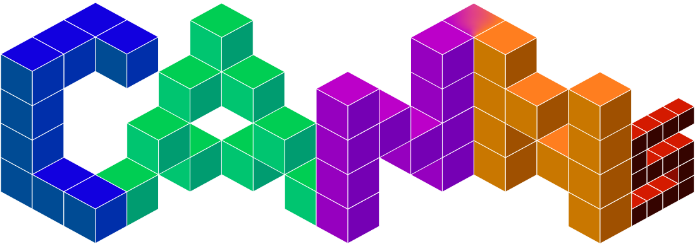

CANNs Documentation
====================

.. image:: https://badges.ws/badge/status-stable-green
   :target: https://github.com/routhleck/canns
   :alt: Status: Stable

.. image:: https://img.shields.io/pypi/pyversions/canns
   :target: https://pypi.org/project/canns/
   :alt: Python Versions

.. image:: https://badges.ws/maintenance/yes/2026
   :target: https://github.com/routhleck/canns
   :alt: Maintained

.. image:: https://badges.ws/github/release/routhleck/canns
   :target: https://github.com/routhleck/canns/releases
   :alt: Release

.. image:: https://badges.ws/github/license/routhleck/canns
   :target: https://github.com/routhleck/canns/blob/master/LICENSE
   :alt: License

.. image:: https://zenodo.org/badge/DOI/10.5281/zenodo.18453893.svg
   :target: https://doi.org/10.5281/zenodo.18453893
   :alt: DOI

.. image:: https://badges.ws/github/stars/routhleck/canns?logo=github
   :target: https://github.com/routhleck/canns/stargazers
   :alt: GitHub Stars

.. image:: https://static.pepy.tech/personalized-badge/canns?period=total&units=INTERNATIONAL_SYSTEM&left_color=BLACK&right_color=GREEN&left_text=downloads
   :target: https://pepy.tech/projects/canns
   :alt: Downloads

.. image:: https://deepwiki.com/badge.svg
   :target: https://deepwiki.com/Routhleck/canns
   :alt: Ask DeepWiki

.. image:: https://badges.ws/badge/Buy_Me_a_Coffee-ff813f?icon=buymeacoffee
   :target: https://buymeacoffee.com/forrestcai6
   :alt: Buy Me a Coffee

Welcome to CANNs!
-----------------

CANNs (Continuous Attractor Neural Networks toolkit) is a research toolkit built on `BrainPy <https://github.com/brainpy/BrainPy>`_ and
`JAX <https://github.com/jax-ml/jax>`_, with optional Rust-accelerated ``canns-lib`` for selected performance-critical routines. It bundles
model collections, task generators, analyzers, trainers, and the ASA pipeline (GUI/TUI) so you can run simulations and analyze results in a
consistent workflow.

Architecture
------------

.. figure:: ../_static/architecture.png
   :alt: CANNs Architecture
   :width: 900
   :align: center

   Layer hierarchy of the CANNs library showing five levels: Application (Pipeline orchestration), Functional (Task, Trainer, Analyzer, Utils
   modules), Core Models (CANN implementations), Foundation (BrainPy/JAX and Rust FFI backends), and Hardware (CPU/GPU/TPU support).

Core Features
-------------

- **Model collections**: basic CANNs (1D/2D, SFA), hierarchical path integration, theta-sweep models, brain-inspired models (e.g.,
  Amari-Hopfield, linear/spiking layers)
- **Task generators**: smooth tracking, population coding, template matching, open/closed-loop navigation
- **Analyzer suite**: energy landscapes, tuning curves, raster/firing-rate plots, TDA and decoding utilities, cell classification
- **ASA pipeline & GUI/TUI**: end-to-end workflow for preprocessing, TDA, decoding, and result visualization (e.g.,
  CohoMap/CohoSpace/PathCompare/FR/FRM/GridScore)
- **Training & extensibility**: HebbianTrainer plus base classes for consistent extension
- **Optional acceleration**: ``canns-lib`` for selected performance-critical routines

Model Analysis Overview
-----------------------

.. figure:: ../_static/figure2_full.png
   :alt: Model Analysis Overview
   :width: 900
   :align: center

   Overview of neural dynamics models. Comparison of three basic models: (A) 1D CANN, (B) 2D CANN, and (C) Grid Cell Network.

.. figure:: ../_static/analyzer-display.png
   :alt: Analyzer Display
   :width: 900
   :align: center

   Rich analyzer visualization results.

Visualizations
--------------

.. raw:: html

   

   

      

         

            <h4 class="viz-title">1D CANN Smooth Tracking</h4>
            
            
Real-time dynamics during smooth tracking

         

         

            <h4 class="viz-title">2D CANN Population Encoding</h4>
            
            
Spatial information encoding patterns

         

      

      

         

            <h4 class="viz-title-wide">🔬 Theta Sweep Analysis</h4>
            
            
Theta rhythm modulation in grid and direction cell networks

         

      

      

         

            <h4 class="viz-title">Bump Analysis</h4>
            
            
1D bump fitting and analysis

         

         

            <h4 class="viz-title">Torus Topology Analysis</h4>
            
            
3D torus visualization and decoding

         

      

   

ASA Pipeline (GUI/TUI)
----------------------

.. figure:: ../_static/asa-gui.gif
   :alt: ASA GUI Preview
   :width: 720
   :align: center

   ASA GUI preview.

Quick Start
-----------

Install CANNs:

.. code-block:: bash

   # CPU-only
   pip install canns

   # Optional accelerators (Linux)
   pip install canns[cuda12]
   pip install canns[cuda13]
   pip install canns[tpu]

   # GUI (ASA Pipeline)
   pip install canns[gui]

Optional (uv):

.. code-block:: bash

   uv pip install canns

1D CANN smooth tracking (imports → simulation → visualization):

.. code-block:: python

   import brainpy.math as bm
   from canns.analyzer.visualization import PlotConfigs, energy_landscape_1d_animation
   from canns.models.basic import CANN1D
   from canns.task.tracking import SmoothTracking1D

   # simulation time step
   bm.set_dt(0.1)

   # build model
   cann = CANN1D(num=512)

   # build tracking task (Iext length = duration length + 1)
   task = SmoothTracking1D(
       cann_instance=cann,
       Iext=(0.0, 0.5, 1.0, 1.5),
       duration=(5.0, 5.0, 5.0),
       time_step=bm.get_dt(),
   )
   task.get_data()

   # one-step simulation callback
   def step(t, stimulus):
       cann(stimulus)
       return cann.u.value, cann.inp.value

   # run simulation loop
   us, inputs = bm.for_loop(
       step,
       operands=(task.run_steps, task.data),
   )

   # visualize with energy landscape animation
   config = PlotConfigs.energy_landscape_1d_animation(
       time_steps_per_second=int(1 / bm.get_dt()),
       fps=20,
       title="Smooth Tracking 1D",
       xlabel="State",
       ylabel="Activity",
       show=True,
   )

   energy_landscape_1d_animation(
       data_sets={"u": (cann.x, us), "Iext": (cann.x, inputs)},
       config=config,
   )

Documentation Navigation
------------------------

.. toctree::
   :maxdepth: 1
   :caption: Introduction

   0_why_canns

.. toctree::
   :maxdepth: 2
   :caption: Quick Start Guides

   1_quick_starts/index

.. toctree::
   :maxdepth: 2
   :caption: Core Concepts

   2_core_concepts/index

.. toctree::
   :maxdepth: 2
   :caption: Full Detail Tutorials

   3_full_detail_tutorials/index

.. toctree::
   :maxdepth: 1
   :caption: Resources

   references
   GitHub Repository <https://github.com/routhleck/canns>
   GitHub Issues <https://github.com/routhleck/canns/issues>
   Discussions <https://github.com/routhleck/canns/discussions>

**Language**: `English <../en/index.html>`_ | `中文 <../zh/index.html>`_

Community and Support
---------------------

- **GitHub Repository**: https://github.com/routhleck/canns
- **Issue Tracker**: https://github.com/routhleck/canns/issues
- **Discussions**: https://github.com/routhleck/canns/discussions
- **Documentation**: https://routhleck.com/canns/

Contributing
------------

Contributions are welcome! Please check our `Contribution Guidelines <https://github.com/routhleck/canns/blob/master/CONTRIBUTING.md>`_.

Citation
--------

If you use CANNs in your research, please cite:

.. code-block:: bibtex

   @software{he_2026_canns,
     author       = {He, Sichao and
                     Tuerhong, Aiersi and
                     She, Shangjun and
                     Chu, Tianhao and
                     Wu, Yuling and
                     Zuo, Junfeng and
                     Wu, Si},
     title        = {CANNs: Continuous Attractor Neural Networks Toolkit},
     month        = feb,
     year         = 2026,
     publisher    = {Zenodo},
     version      = {v1.0.0},
     doi          = {10.5281/zenodo.18453893},
     url          = {https://doi.org/10.5281/zenodo.18453893}
   }
