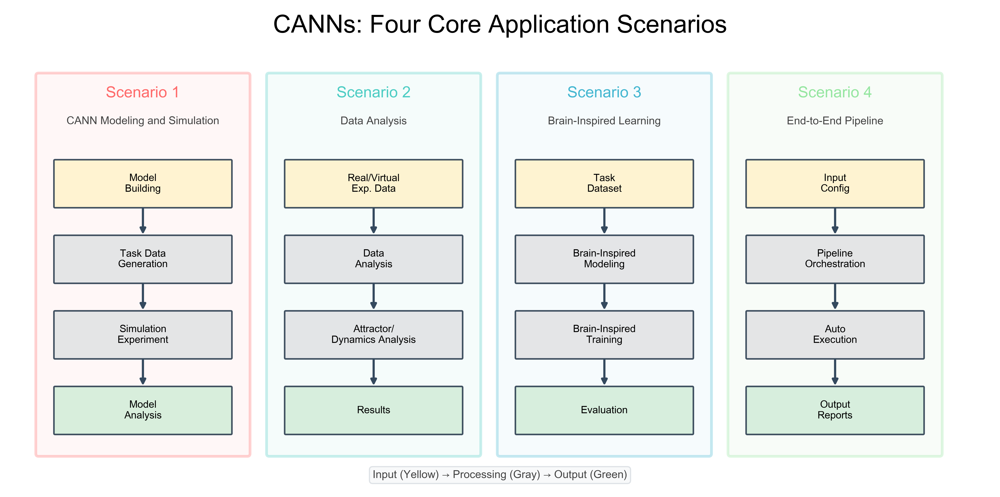

=====================================================
设计哲学与架构概览
=====================================================

本文档解释了CANNs库的核心设计原则和模块组织结构。

核心设计原则
======================

CANNs库围绕两个基本原则构建，这些原则指导其架构和实现。

关注点分离
----------------------

库将不同的功能职责严格分离到独立的模块中：

**模型** ( ``canns.models`` )
   定义神经网络动力学和状态演化

**任务** ( ``canns.task`` )
   生成实验范式和输入数据

**分析器** ( ``canns.analyzer`` )
   可视化和分析仿真结果

**训练器** ( ``canns.trainer`` )
   为脑启发模型实现学习规则

**流水线** ( ``canns.pipeline`` )
   协调完整的实验工作流

每个模块专注于单一职责。模型不生成自己的输入数据。任务不分析结果。分析器不修改模型参数。这种分离使代码库易于维护、测试和扩展。

通过基类实现可扩展性
-----------------------------------

每个主要组件都从定义标准接口的抽象基类继承：

* ``canns.models.basic.BasicModel`` 用于基础CANN模型
* ``canns.models.brain_inspired.BrainInspiredModel`` 用于脑启发模型
* ``canns.trainer.Trainer`` 用于训练算法

这些基类建立了契约，确保所有实现都能与库的其余部分无缝协作。用户可以通过继承这些基类并实现所需方法来创建自定义模型、任务或训练器。

模块架构
===================

四个核心应用场景
--------------------------------

CANNs库支持四种不同的工作流，每种都针对不同的研究需求。这些场景展示了架构的模块化设计和灵活性。

   CANNs四个核心应用场景

**场景1：CANN建模与仿真**

研究连续吸引子动力学的最常见工作流::

   模型构建 → 任务数据生成 → 仿真实验 → 模型分析

步骤：

1. **模型构建**：创建和配置CANN模型（ ``CANN1D()`` , ``CANN2D()`` ）
2. **任务数据生成**：使用任务生成器生成输入（ ``SmoothTracking1D`` ）
3. **仿真实验**：使用 ``bm.for_loop`` 运行动力学
4. **模型分析**：使用模型分析器可视化（ ``animate_dynamics()`` , ``energy_landscape_1d()`` ）

用例：测试CANN理论、参数探索、理解吸引子动力学

**场景2：数据分析**

分析实验或虚拟神经记录::

   真实/虚拟实验数据 → 数据分析 → 吸引子/动力学分析 → 结果

步骤：

1. **真实/虚拟实验数据**：加载脉冲序列或放电率数据
2. **数据分析**：使用数据分析器工具处理
3. **吸引子/动力学分析**：应用凸起拟合、解码、TDA方法
4. **结果**：提取编码变量、表征群体活动

用例：针对神经记录验证模型、从实验中解码空间变量

**场景3：脑启发学习**

使用生物学合理的学习规则训练网络::

   任务数据集 → 脑启发建模 → 脑启发训练 → 评估

步骤：

1. **任务数据集**：准备训练模式
2. **脑启发建模**：创建具有可学习权重的模型（ ``AmariHopfieldNetwork`` ）
3. **脑启发训练**：通过 ``Trainer`` 的子类应用Hebbian/STDP/BCM学习
4. **评估**：测试模式完成、测量存储容量

用例：研究联想记忆、探索局部学习规则、理解自组织

**场景4：端到端流水线**

从配置到结果的自动化实验工作流::

   输入配置 → 流水线编排 → 自动执行 → 输出报告

步骤：

1. **输入配置**：通过配置文件指定参数
2. **流水线编排**： ``canns.pipeline`` 协调所有模块
3. **自动执行**：自动创建模型、仿真和分析
4. **输出报告**：生成综合结果摘要

用例：系统化参数扫描、可重复实验、批量处理

模块交互模式
---------------------------

.. note::

   在所有场景中，模块遵循关注点分离原则进行交互：

   * **输入阶段**：数据进入系统（模型、数据集、配置）
   * **处理阶段**：核心计算（仿真、训练、分析）
   * **输出阶段**：结果可视化和解释

   这种一致的结构使库既直观又支持多样化的研究工作流。

BrainPy集成
----------------------

CANNs库基于BrainPy（ ``brainpy`` ），这是一个强大的脑动力学编程框架。BrainPy提供：

**动力学抽象**
   用于神经系统的 ``bp.DynamicalSystem`` 基类

**状态管理**
   ``bm.Variable`` 容器用于所有状态变量（替代以前分离的 State、HiddenState、ParamState）

**时间步长控制**
   ``bm.set_dt(...)`` 和 ``bm.get_dt()`` 用于统一的时间管理

**JIT编译**
   ``bm.for_loop`` 用于高性能仿真

**随机数管理**
   ``bm.random`` 用于可重复的随机性

有了BrainPy，CANN模型只需定义变量和更新方程。时间步进、并行化和编译都由BrainPy自动处理，显著降低了实现复杂性。

模块关系
====================

模块如何交互
--------------------

模型 ↔ 任务耦合
~~~~~~~~~~~~~~~~~~~~~~

某些任务需要模型实例来访问刺激生成方法。例如， ``SmoothTracking1D`` 需要访问 ``model.get_stimulus_by_pos()`` 来将位置坐标转换为神经输入模式。这种耦合是为了用户便利而有意设计的，但仅限于跟踪任务。

模型 ↔ 分析器独立性
~~~~~~~~~~~~~~~~~~~~~~~~~~~~~~

分析器处理模型输出（放电率、膜电位），但不修改模型状态。它们接受NumPy数组形式的仿真结果并生成可视化。这种独立性使同一个分析器可以用于任何产生兼容输出的模型。

模型 ↔ 训练器协作
~~~~~~~~~~~~~~~~~~~~~~~~~~~~~~

训练器根据学习规则修改模型参数（特别是连接权重）。它们通过约定的属性与模型交互，如 ``model.W`` 表示权重， ``model.s`` 表示状态向量。训练器框架专为使用局部、活动依赖可塑性的脑启发模型设计。

流水线编排
~~~~~~~~~~~~~~~~~~~~~~~

``canns.pipeline`` 模块将所有其他模块协调成完整的实验工作流。它管理从模型设置到任务执行再到结果分析的完整周期，为常见用例提供高级接口。

设计权衡
=================

灵活性 vs. 便利性
---------------------------

库平衡了两个竞争需求：

**灵活性**
   高级用户可以覆盖任何组件或创建自定义实现

**便利性**
   标准工作流应该需要最少的样板代码

这种平衡通过合理的默认值与广泛的自定义选项相结合来实现。例如， ``CANN1D()`` 使用适用于大多数情况的默认参数，但每个参数都可以显式指定。

性能 vs. 简单性
--------------------------

库通过多层策略实现高性能：

Python层（BrainPy/JAX）
~~~~~~~~~~~~~~~~~~~~~~~~~~~~~~

基于JAX的编译提供GPU/TPU加速，但需要函数式编程模式。库通过以下方式抽象这种复杂性：

* 在BrainPy的 ``for_loop`` 中封装JIT编译
* 通过显式容器管理状态
* 提供处理常见模式的实用函数

用户无需直接编写JAX特定代码即可受益于GPU/TPU加速。

原生层（canns-lib）
~~~~~~~~~~~~~~~~~~~~~~~~~

.. important::

   对于Python开销显著的性能关键操作，库通过 ``canns-lib`` 提供可选的Rust驱动后端：

   * **Ripser模块**：拓扑数据分析，相对纯Python平均加速1.13倍（最高1.82倍）
   * **空间导航**：加速RatInABox环境，长轨迹积分加速约700倍
   * **未来模块**：计划支持近似最近邻、动力学计算

   canns-lib集成遵循相同原则：暴露简单的Python API，同时为瓶颈操作利用原生性能。用户可以在不改变代码结构的情况下选择性启用这些加速。

扩展库
=====================

创建自定义模型
----------------------

要添加新模型，从适当的基类继承并实现所需方法。

对于基础模型：

* ``make_conn()`` ：生成连接矩阵
* ``get_stimulus_by_pos()`` ：将位置转换为输入模式
* ``init_state()`` ：注册状态变量
* ``update()`` ：定义单步动力学

对于脑启发模型：

* ``init_state()`` ：注册状态和权重参数
* ``update()`` ：定义状态演化
* ``energy`` ：返回网络能量的属性

创建自定义任务
---------------------

.. tip::

   任务应该生成与模型期望兼容的输入序列。关键考虑因素：

   * 使用 ``bm.get_dt()`` 确保时间步长一致性
   * 以模型期望的格式返回数据
   * 提供用于分析的轨迹信息

创建自定义训练器
-------------------------

.. note::

   训练器继承自 ``canns.trainer.Trainer`` 并实现：

   * ``train()`` ：参数更新策略
   * ``predict()`` ：单样本推理
   * 标准进度和编译配置

总结
=======

CANNs库通过精心的架构选择实现其目标：

1. **关注点分离** 保持模块专注且独立
2. **基类继承** 确保一致的接口
3. **BrainPy集成** 在不增加复杂性的情况下提供性能
4. **灵活耦合** 平衡便利性与模块化

这些原则既支持快速原型开发又支持严格的研究，同时保持代码质量和可扩展性。
