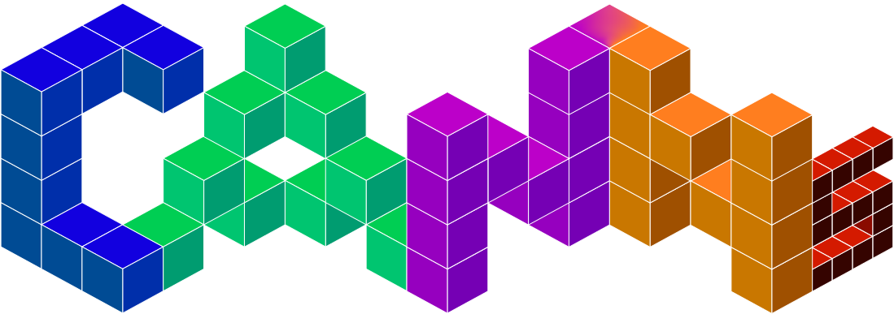
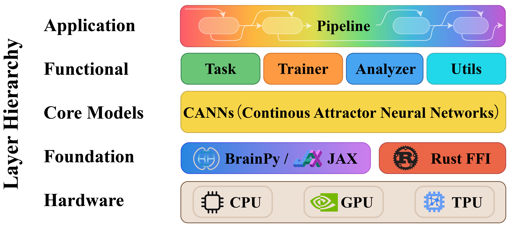
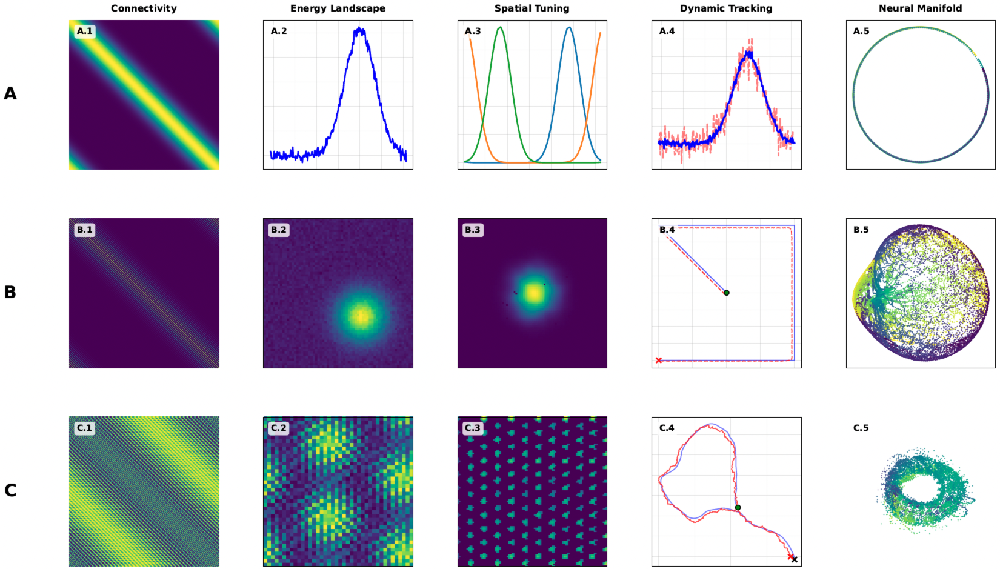
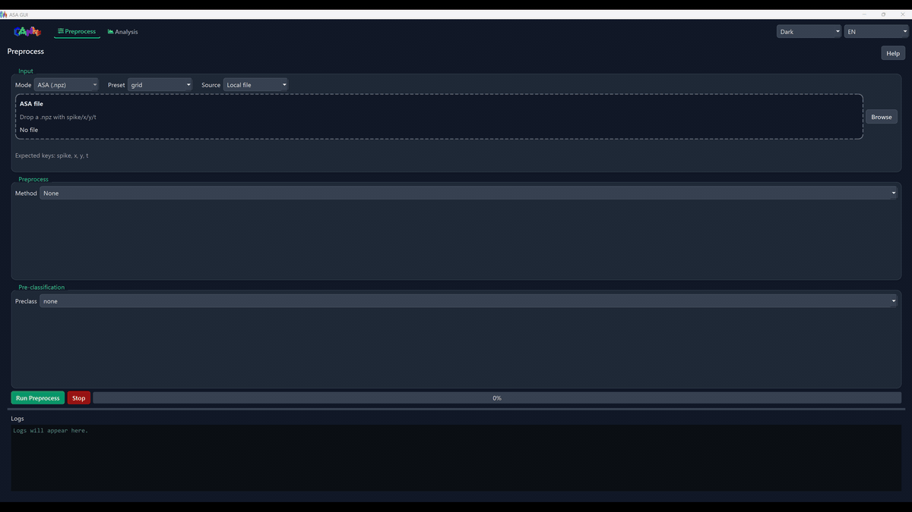

[ANONYMOUS_PROJECT] 文档
====================

.. image:: https://badges.ws/badge/status-stable-green
   :target: [ANONYMOUS_REPO]
   :alt: 状态：稳定

.. image:: https://img.shields.io/pypi/pyversions/[ANONYMOUS_PROJECT]
   :target: https://pypi.org/project/[ANONYMOUS_PROJECT]/
   :alt: Python 版本

.. image:: https://badges.ws/maintenance/yes/2026
   :target: [ANONYMOUS_REPO]
   :alt: 持续维护

.. image:: https://badges.ws/github/release/[ANONYMOUS_ORG]/[ANONYMOUS_PROJECT]
   :target: [ANONYMOUS_REPO]/releases
   :alt: 发行版本

.. image:: https://badges.ws/github/license/[ANONYMOUS_ORG]/[ANONYMOUS_PROJECT]
   :target: [ANONYMOUS_REPO]/blob/master/LICENSE
   :alt: 许可证

.. image:: https://zenodo.org/badge/DOI/10.5281/zenodo.18453893.svg
   :target: https://doi.org/10.5281/zenodo.18453893
   :alt: DOI

.. image:: https://badges.ws/github/stars/[ANONYMOUS_ORG]/[ANONYMOUS_PROJECT]?logo=github
   :target: [ANONYMOUS_REPO]/stargazers
   :alt: GitHub Stars

.. image:: https://static.pepy.tech/personalized-badge/[ANONYMOUS_PROJECT]?period=total&units=INTERNATIONAL_SYSTEM&left_color=BLACK&right_color=GREEN&left_text=downloads
   :target: https://pepy.tech/projects/[ANONYMOUS_PROJECT]
   :alt: 下载量

.. image:: https://deepwiki.com/badge.svg
   :target: https://deepwiki.com/[ANONYMOUS_ORG]/[ANONYMOUS_PROJECT]
   :alt: 询问 DeepWiki

欢迎使用 [ANONYMOUS_PROJECT]！
-----------------

[ANONYMOUS_PROJECT]（Continuous Attractor Neural Networks toolkit）是基于 `BrainPy <https://github.com/brainpy/BrainPy>`_ 与
`JAX <https://github.com/jax-ml/jax>`_ 构建的研究工具库，并可选使用 Rust 加速库 ``[ANONYMOUS_PROJECT]-lib`` 优化部分性能敏感例程（如
TDA/Ripser 与任务生成）。它集成模型集合、任务生成器、分析器、训练器与 ASA 流水线（GUI/TUI），以统一工作流完成仿真与分析。

架构
------------

   [ANONYMOUS_PROJECT] 库的层级结构，展示五个层级：应用层（流水线编排）、功能层（任务/训练器/分析器/工具模块）、核心模型层（CANN 实现）、基础层
   （BrainPy/JAX 与 Rust FFI 后端）以及硬件层（CPU/GPU/TPU 支持）。

核心特性
-------------

- **模型集合**：基础 CANN（1D/2D、SFA）、层级路径积分、theta-sweep 模型、类脑模型（如 Amari-Hopfield、线性/脉冲层）
- **任务生成**：平滑追踪、群体编码、模板匹配、开/闭环导航
- **分析器能力**：能量景观、调谐曲线、栅格/放电率图、TDA 与解码工具、细胞分类
- **ASA 流水线 & GUI/TUI**：端到端流程（预处理、TDA、解码与结果可视化，如 CohoMap/CohoSpace/PathCompare/FR/FRM/GridScore）
- **训练与扩展**：HebbianTrainer 与统一基类便于扩展
- **可选加速**：``[ANONYMOUS_PROJECT]-lib`` 覆盖部分性能敏感例程

模型分析概览
-----------------------

   神经动力学模型对比概览： (A) 一维 CANN，(B) 二维 CANN，(C) 网格细胞网络。

.. figure:: ../_static/analyzer-display.png
   :alt: Analyzer Display
   :width: 900
   :align: center

   丰富的 Analyzer 可视化结果。

可视化展示
----------

.. raw:: html

   

   

      

         

            <h4 class="viz-title">1D CANN 平滑追踪</h4>
            
            
平滑追踪过程中的实时动力学

         

         

            <h4 class="viz-title">2D CANN 群体编码</h4>
            
            
空间信息编码模式

         

      

      

         

            <h4 class="viz-title-wide">🔬 Theta 扫描分析</h4>
            
            
网格细胞和方向细胞网络中的 theta 节律调制

         

      

      

         

            <h4 class="viz-title">活动波包分析</h4>
            
            
1D 活动波包拟合和分析

         

         

            <h4 class="viz-title">环面拓扑分析</h4>
            
            
3D 环面可视化和解码

         

      

   

ASA 流水线（GUI/TUI）
----------------------

   ASA GUI 预览。

快速开始
-----------

安装 [ANONYMOUS_PROJECT]：

.. code-block:: bash

   # 仅 CPU
   pip install [ANONYMOUS_PROJECT]

   # 可选加速（Linux）
   pip install [ANONYMOUS_PROJECT][cuda12]
   pip install [ANONYMOUS_PROJECT][cuda13]
   pip install [ANONYMOUS_PROJECT][tpu]

   # GUI（ASA Pipeline）
   pip install [ANONYMOUS_PROJECT][gui]

可选（uv）：

.. code-block:: bash

   uv pip install [ANONYMOUS_PROJECT]

1D CANN 平滑追踪（导入 → 仿真 → 可视化）：

.. code-block:: python

   import brainpy.math as bm
   from [ANONYMOUS_PROJECT].analyzer.visualization import PlotConfigs, energy_landscape_1d_animation
   from [ANONYMOUS_PROJECT].models.basic import CANN1D
   from [ANONYMOUS_PROJECT].task.tracking import SmoothTracking1D

   # 模拟时间步长
   bm.set_dt(0.1)

   # 构建模型
   cann = CANN1D(num=512)

   # 构建追踪任务（Iext 长度 = duration 长度 + 1）
   task = SmoothTracking1D(
       cann_instance=cann,
       Iext=(0.0, 0.5, 1.0, 1.5),
       duration=(5.0, 5.0, 5.0),
       time_step=bm.get_dt(),
   )
   task.get_data()

   # 单步仿真回调
   def step(t, stimulus):
       cann(stimulus)
       return cann.u.value, cann.inp.value

   # 运行仿真循环
   us, inputs = bm.for_loop(
       step,
       operands=(task.run_steps, task.data),
   )

   # 能量景观动画可视化
   config = PlotConfigs.energy_landscape_1d_animation(
       time_steps_per_second=int(1 / bm.get_dt()),
       fps=20,
       title="Smooth Tracking 1D",
       xlabel="State",
       ylabel="Activity",
       show=True,
   )

   energy_landscape_1d_animation(
       data_sets={"u": (cann.x, us), "Iext": (cann.x, inputs)},
       config=config,
   )

文档导航
------------------------

.. toctree::
   :maxdepth: 1
   :caption: 简介

   0_why_[ANONYMOUS_PROJECT]

.. toctree::
   :maxdepth: 2
   :caption: 快速入门指南

   1_quick_starts/index

.. toctree::
   :maxdepth: 2
   :caption: 核心概念

   2_core_concepts/index

.. toctree::
   :maxdepth: 2
   :caption: 详细教程

   3_full_detail_tutorials/index

.. toctree::
   :maxdepth: 1
   :caption: 资源

   references
   GitHub 仓库 <[ANONYMOUS_REPO]>
   GitHub Issues <[ANONYMOUS_REPO]/issues>
   讨论区 <[ANONYMOUS_REPO]/discussions>

**语言**: `English <../en/index.html>`_ | `中文 <../zh/index.html>`_

社区和支持
---------------------

- **GitHub 仓库**: [ANONYMOUS_REPO]
- **问题追踪**: [ANONYMOUS_REPO]/issues
- **讨论区**: [ANONYMOUS_REPO]/discussions
- **文档**: [ANONYMOUS_DOCS]

贡献
------------

欢迎贡献！请查看我们的 `贡献指南 <[ANONYMOUS_REPO]/blob/master/CONTRIBUTING.md>`_。

引用
--------

如果您在研究中使用了 [ANONYMOUS_PROJECT]，请引用：

.. code-block:: bibtex

   @software{he_2026_[ANONYMOUS_PROJECT],
     author       = {[ANONYMOUS_AUTHOR] and
                     Tuerhong, Aiersi and
                     She, Shangjun and
                     Chu, Tianhao and
                     Wu, Yuling and
                     Zuo, Junfeng and
                     Wu, Si},
     title        = {[ANONYMOUS_PROJECT]: Continuous Attractor Neural Networks Toolkit},
     month        = feb,
     year         = 2026,
     publisher    = {Zenodo},
     version      = {v1.0.0},
     doi          = {10.5281/zenodo.18453893},
     url          = {https://doi.org/10.5281/zenodo.18453893}
   }
